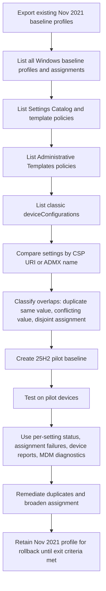

# Updating Intune Windows security baselines for a 25H2 estate

## Executive summary

Your current position is a classic high-risk baseline drift scenario: you have Windows security baseline profiles that have not been refreshed since November 2021, Intune changed baseline architecture in May 2023, existing profiles do not auto-update, and older versions become read-only once newer versions exist. For your estate, the current Microsoft-recommended Windows baseline in Intune is version 25H2, and Microsoft explicitly states that the Intune 25H2 Windows baseline is sourced from the Windows 11 version 25H2 security baseline.

There is also an important naming versus operating-system nuance to clear up before you proceed. Intune still presents this family under the historic "Security Baseline for Windows 10 and later" lineage in its overview pages, but the 25H2 baseline payload is based on Windows 11 version 25H2. That matters because Windows 10 reached end of support on 14 October 2025 and 22H2 was the final Windows 10 release. In practical terms, a real "25H2-only" estate means Windows 11 25H2 devices managed under the Windows platform in Intune, not Windows 10 25H2 devices.

The safest migration approach is not an in-place replacement of your November 2021 baseline as the first move. Instead, build a side-by-side Windows 25H2 pilot baseline, inventory every other Intune policy family that can set overlapping Windows security controls, remove or narrow duplicate ownership, validate on pilot rings, and only then move production assignments. This is especially important because Microsoft documents that pre-May 2023 baseline profiles follow a separate upgrade scenario, and recommends testing version changes on a copy before changing assigned profiles.

The single most important design rule is ownership: for any given Windows security setting, choose one primary Intune policy source. Microsoft now states that all Intune configuration policy types are equal sources of device configuration, that configuration conflicts require manual resolution, and that the best practice is to use endpoint security policies or security baselines for the same settings, not both. Compliance policies are different: they evaluate resulting state and, where the same setting appears in both compliance and configuration policy, compliance takes precedence.

## Baseline position for a 25H2-only estate

Microsoft lists the Windows security baseline instances currently available in Intune as 25H2, 24H2, 23H2, November 2021, December 2020, and August 2020. The same overview states that when a newer version becomes available, older profiles become read-only, remain usable, and can either be updated to the newer version or left in place while you create new profiles. That means your November 2021 profiles can remain as rollback artefacts while you introduce new 25H2 profiles.

Microsoft also explains that the May 2023 baseline format change made newer baselines map directly to CSP-backed setting names, and Intune introduced a special migration process for moving older baselines to post-May 2023 versions. For an estate that has not moved since November 2021, this is not a routine minor update. Treat it as a structured migration project, not a quick profile edit.

A 25H2-only estate works in your favour operationally. Several of the newer Windows baseline controls, especially in the LanmanServer family such as authentication rate limiting, mailslots, and SMB dialect constraints, are documented as supported on Windows 11 version 24H2 and later. Because your estate is exclusively 25H2, you do not need mixed-OS exception branches for those controls.

## Discovery and inventory method

Microsoft's own documentation points to four places you must use together for discovery: security baselines, device configuration policies, endpoint security policies, and reporting. For auditability, also export old baseline settings and review audit logs. Graph is useful for structured inventory because Microsoft documents `/deviceManagement/intents`, `/deviceManagement/configurationPolicies`, `/deviceManagement/groupPolicyConfigurations`, and `/deviceManagement/deviceConfigurations` as the key policy families to enumerate, with `DeviceManagementConfiguration.Read.All` as the minimum Graph permission for those Intune configuration resources.

### Discovery workflow



The table below is the practical inventory sequence I would use in a live tenant.

| Step | What to inspect | Why it matters | Minimum rights / permission | Evidence |
|---|---|---|---|---|
| Export each existing November 2021 Windows baseline profile | Capture current customisations before any change | Needed because pre-May 2023 updates are a separate scenario and export is built into the baseline workflow | Intune RBAC with Organization Read and Security baselines Assign/Create/Delete/Read/Update; least-privileged built-in role is Policy and Profile Manager | Microsoft baseline management guidance and RBAC requirements  |
| Endpoint security > Security baselines > Windows baseline > Profiles and Versions | Identify all Windows baseline profiles, versions in use, assignments, descriptions, scope tags | Shows whether old and new versions coexist and which profiles must be migrated | Policy and Profile Manager or equivalent custom role | Baseline overview and management docs  |
| Devices > Manage devices > Configuration | Discover Settings Catalog, templates, imported/adopted configuration profiles that may own the same settings | Settings catalog conflicts with other configuration policies at setting level | Device Configuration Read plus reporting rights; Graph `DeviceManagementConfiguration.Read.All` for API export | Settings catalog reporting and Graph config policy docs  |
| `/beta/deviceManagement/configurationPolicies` | Export modern device configuration policies, including settings and assignments | Best structured source for Settings Catalog and modern templates | Graph `DeviceManagementConfiguration.Read.All` | Graph list configuration policies doc  |
| `/beta/deviceManagement/groupPolicyConfigurations` | Export Administrative Templates policies | Many 2021-era overlaps are ADMX-backed and live here | Graph `DeviceManagementConfiguration.Read.All` | Graph groupPolicyConfiguration docs  |
| `/beta/deviceManagement/deviceConfigurations` | Export classic device configuration profiles | Older tenants often still have legacy templates here | Graph `DeviceManagementConfiguration.Read.All` | Graph deviceConfigurations API doc  |
| `/beta/deviceManagement/intents` and `/assignments` | Export baseline profiles and assignments | Security baselines are represented through device management intents | Graph `DeviceManagementConfiguration.Read.All` | Graph intents and assignments docs  |
| Endpoint security workloads such as Antivirus, Firewall, Disk encryption, ASR | Detect endpoint security policies that overlap with the Windows baseline | Microsoft says endpoint security and baselines are equal configuration sources and can conflict | Endpoint Security Manager or equivalent | Endpoint security management guidance and conflict guidance  |
| Devices > Monitor > Configuration policy assignment failures | Find conflict and error states across security baselines and endpoint security profiles | This report explicitly includes security baselines and endpoint security policies | Device Configuration Read, Security Baseline Read, and report visibility as documented | Intune reports doc  |
| Tenant administration > Audit logs | Confirm who created, edited, assigned, or changed profiles | Useful to trace historic duplication and recent emergency edits | Audit data - Read or Intune Administrator | Audit logs docs  |
| Per-device Device configuration report and local MDM diagnostic report | Identify the exact policy source of conflicts on a device | Fastest way to determine which profiles are colliding on the same endpoint | Read/report rights plus local device access for diagnostics | Baseline monitoring and MDM diagnostics docs  |

### Step-by-step UI method

1. In the admin centre, go to Endpoint security > Security baselines, open the Windows baseline family, review Profiles, and then review Versions to see which version each profile uses. Export every November 2021 profile before changing anything.  
2. Go to Devices > Manage devices > Configuration and export or record every Settings Catalog and template profile that applies to Windows. Use each policy's View report and Per setting status pages to identify settings already in conflict.  
3. Review endpoint security policy workloads separately, especially Antivirus, Firewall, Disk encryption, and Attack surface reduction. Microsoft explicitly warns against double-managing the same settings through baselines and endpoint security.  
4. Open Devices > Monitor > Configuration policy assignment failures and filter for Windows and relevant policy types. This report includes security baselines and you can drill down to device and setting level.  
5. For a pilot device, use the per-device Device configuration report and then the local MDM diagnostic report from Settings > Accounts > Access work or school > your work account > Info > Advanced Diagnostic Report > Create report. This is the most reliable way to pinpoint an actual source collision on-device.

### Sample Graph and PowerShell inventory commands

The endpoints below are the core ones Microsoft documents for baseline and configuration inventory. They all require an active Intune licence and the documented Graph configuration permission set. `/beta` is appropriate here because Microsoft still documents Intune baseline and several policy inventory resources there.

```powershell
Connect-MgGraph -Scopes "DeviceManagementConfiguration.Read.All"
Select-MgProfile beta

$uris = @(
    "https://graph.microsoft.com/beta/deviceManagement/intents",
    "https://graph.microsoft.com/beta/deviceManagement/configurationPolicies",
    "https://graph.microsoft.com/beta/deviceManagement/groupPolicyConfigurations",
    "https://graph.microsoft.com/beta/deviceManagement/deviceConfigurations"
)

foreach ($uri in $uris) {
    Write-Host ""
    Write-Host "==== $uri ===="
    $response = Invoke-MgGraphRequest -Method GET -Uri $uri
    $response.value |
        Select-Object '@odata.type', id, displayName, description, createdDateTime, lastModifiedDateTime
}
```

```powershell
# Example: review assignments for a specific Windows baseline profile (intent)
$baselineId = "<baseline-intent-id>"
Invoke-MgGraphRequest -Method GET `
    -Uri "https://graph.microsoft.com/beta/deviceManagement/intents/$baselineId/assignments"
```

```powershell
# Example: export basic inventory to CSV for spreadsheet comparison
$intents = Invoke-MgGraphRequest -Method GET -Uri "https://graph.microsoft.com/beta/deviceManagement/intents"
$intents.value |
    Select-Object id, displayName, description, createdDateTime, lastModifiedDateTime |
    Export-Csv .\intune-baseline-intents.csv -NoTypeInformation

$configPolicies = Invoke-MgGraphRequest -Method GET -Uri "https://graph.microsoft.com/beta/deviceManagement/configurationPolicies"
$configPolicies.value |
    Select-Object id, name, description, createdDateTime, lastModifiedDateTime |
    Export-Csv .\intune-configuration-policies.csv -NoTypeInformation
```

The comparison key you should normalise on is not the friendly setting name. Use the full CSP URI where available, or the ADMX-backed policy name / registry value when the setting is ADMX-backed. That gives you a stable deduplication key across baseline export, Settings Catalog export, Administrative Templates, and custom OMA-URI work. Microsoft explicitly notes on the newer baseline references that the post-May 2023 format maps directly to CSP names, and many ADMX-backed CSP pages expose the ADMX mapping and registry value name you can use as the key.

## Windows 25H2 baseline mapping

The table below is the high-value mapping set I would use first for duplicate and conflict discovery. It focuses on the Windows baseline settings most likely to collide with existing Intune security, browser, Defender, firewall, BitLocker, and legacy admin template policies. Microsoft's canonical full list remains the Intune 25H2 baseline settings reference page, where each setting links to its source CSP when available.

A practical note: where a row is marked ADMX-backed, the baseline UI handles the plumbing for you. The CSP page still matters for duplicate discovery because it exposes the stable policy name, ADMX file, registry value, and path you can use for cross-policy matching.

| Baseline setting | Intune baseline location | CSP or ADMX-backed policy path | 25H2 recommended value | Evidence |
|---|---|---|---|---|
| Apply UAC restrictions to local accounts on network logons | Administrative Templates > MS Security Guide | `./Device/Vendor/MSFT/Policy/Config/MSSecurityGuide/ApplyUACRestrictionsToLocalAccountsOnNetworkLogon` | Enabled | Baseline plus CSP mapping  |
| Turn off multicast name resolution | Administrative Templates > Network > DNS Client | `./Device/Vendor/MSFT/Policy/Config/ADMX_DnsClient/Turn_Off_Multicast` | Enabled | Baseline plus CSP mapping  |
| Hardened UNC Paths | Administrative Templates > Network > Network Provider | `./Device/Vendor/MSFT/Policy/Config/Connectivity/HardenedUNCPaths` | Enabled, with `\\*\SYSVOL` and `\\*\NETLOGON` requiring mutual authentication and integrity | Baseline plus CSP mapping  |
| Limits print driver installation to Administrators | Administrative Templates > Printers | ADMX-backed `RestrictDriverInstallationToAdministrators` under `Printing.admx` | Enabled | Baseline plus CSP mapping  |
| Deny write access to fixed drives not protected by BitLocker | Administrative Templates > Windows Components > BitLocker Drive Encryption > Fixed Data Drives | ADMX-backed `FDVDenyWriteAccess` | Disabled | Baseline plus CSP mapping  |
| Deny write access to removable drives not protected by BitLocker | Administrative Templates > Windows Components > BitLocker Drive Encryption > Removable Data Drives | ADMX-backed `RDVDenyWriteAccess` | Enabled; cross-organisation write access not allowed by default | Baseline plus CSP mapping  |
| Turn on PowerShell Script Block Logging | Administrative Templates > Windows Components > Windows PowerShell | ADMX-backed `EnableScriptBlockLogging` | Enabled | Baseline plus CSP mapping  |
| Allow Basic authentication for WinRM client | Administrative Templates > Windows Components > WinRM Client | `./Device/Vendor/MSFT/Policy/Config/RemoteManagement/AllowBasicAuthentication_Client` | Disabled | Baseline plus CSP mapping  |
| Allow Password Manager | Browser | `./Device/Vendor/MSFT/Policy/Config/Browser/AllowPasswordManager` | Block | Baseline plus CSP mapping  |
| Prevent certificate error overrides | Browser | `./Device/Vendor/MSFT/Policy/Config/Browser/PreventCertErrorOverrides` | Enabled | Baseline plus CSP mapping  |
| Allow direct memory access | Data Protection | `./Device/Vendor/MSFT/Policy/Config/DataProtection/AllowDirectMemoryAccess` | Block | Baseline plus CSP mapping  |
| Enable Network Protection | Defender | `./Device/Vendor/MSFT/Policy/Config/Defender/EnableNetworkProtection` | Enabled (block mode) | Baseline plus CSP mapping  |
| PUA Protection | Defender | `./Device/Vendor/MSFT/Policy/Config/Defender/PUAProtection` | Block | Baseline plus CSP mapping  |
| Submit samples consent | Defender | `./Device/Vendor/MSFT/Policy/Config/Defender/SubmitSamplesConsent` | Send all samples automatically | Baseline plus CSP mapping  |
| Credential Guard | Device Guard | `./Device/Vendor/MSFT/Policy/Config/DeviceGuard/LsaCfgFlags` | Enabled with UEFI lock | Baseline plus CSP mapping  |
| Enable virtualization based security | Device Guard | `./Device/Vendor/MSFT/Policy/Config/DeviceGuard/EnableVirtualizationBasedSecurity` | Enabled | Baseline plus CSP mapping  |
| Require platform security features | Device Guard | `./Device/Vendor/MSFT/Policy/Config/DeviceGuard/RequirePlatformSecurityFeatures` | Secure Boot only (value 1) | Baseline plus CSP mapping  |
| Enable domain firewall | Firewall | `./Vendor/MSFT/Firewall/MdmStore/DomainProfile/EnableFirewall` | True | Baseline plus CSP mapping  |
| Domain default inbound action | Firewall | `./Vendor/MSFT/Firewall/MdmStore/DomainProfile/DefaultInboundAction` | Block (1) | Baseline plus CSP mapping  |
| Domain log max file size | Firewall | `./Vendor/MSFT/Firewall/MdmStore/DomainProfile/LogMaxFileSize` | 16384 KB | Baseline plus CSP mapping  |
| Enable private firewall | Firewall | `./Vendor/MSFT/Firewall/MdmStore/PrivateProfile/EnableFirewall` | True | Baseline plus CSP mapping  |
| Private default inbound action | Firewall | `./Vendor/MSFT/Firewall/MdmStore/PrivateProfile/DefaultInboundAction` | Block (1) | Baseline plus CSP mapping  |
| Auth rate limiter delay | Lanman Server | `./Device/Vendor/MSFT/Policy/Config/LanmanServer/AuthRateLimiterDelayInMs` | 2000 ms | Baseline plus CSP mapping; supported on Windows 11 24H2 and later |  |
| Enable authentication rate limiter | Lanman Server | `./Device/Vendor/MSFT/Policy/Config/LanmanServer/EnableAuthRateLimiter` | Enabled | Baseline plus CSP mapping; supported on Windows 11 24H2 and later |  |
| Enable mailslots | Lanman Server | `./Device/Vendor/MSFT/Policy/Config/LanmanServer/EnableMailslots` | Disabled | Baseline plus CSP mapping; supported on Windows 11 24H2 and later |  |
| Max SMB2 dialect | Lanman Server | `./Device/Vendor/MSFT/Policy/Config/LanmanServer/MaxSmb2Dialect` | SMB 3.1.1 (785) | Baseline plus CSP mapping; supported on Windows 11 24H2 and later |  |
| Min SMB2 dialect | Lanman Server | `./Device/Vendor/MSFT/Policy/Config/LanmanServer/MinSmb2Dialect` | SMB 3.0.0 (768) | Baseline plus CSP mapping; supported on Windows 11 24H2 and later |  |
| Limit blank-password local accounts to console logon only | Local Policies Security Options | `./Device/Vendor/MSFT/Policy/Config/LocalPoliciesSecurityOptions/Accounts_LimitLocalAccountUseOfBlankPasswordsToConsoleLogonOnly` | Enabled | Baseline plus CSP mapping  |
| Machine inactivity limit | Local Policies Security Options | `./Device/Vendor/MSFT/Policy/Config/LocalPoliciesSecurityOptions/InteractiveLogon_MachineInactivityLimit` | 900 seconds | Baseline plus CSP mapping  |
| Microsoft network client digitally sign communications always | Local Policies Security Options | `./Device/Vendor/MSFT/Policy/Config/LocalPoliciesSecurityOptions/MicrosoftNetworkClient_DigitallySignCommunicationsAlways` | Enable | Baseline plus CSP mapping  |
| Configure LSA protected process | Local Security Authority | `./Device/Vendor/MSFT/Policy/Config/LocalSecurityAuthority/ConfigureLsaProtectedProcess` | Enabled with UEFI lock | Baseline plus CSP mapping  |

## Design and creation guidance

For your estate, I would create three Windows baseline profiles, all on the Windows baseline family and version 25H2: one pilot profile, one production profile, and one tightly scoped exception profile. That keeps ownership explicit while avoiding ad hoc edits to a single broad production profile. Because Microsoft says older profiles remain usable while newer profiles are introduced, you can run this in parallel with the November 2021 profile during testing.

A practical naming convention that scales well is:

- `WIN-SB-25H2-PILOT-v1.0`
- `WIN-SB-25H2-PROD-v1.0`
- `WIN-SB-25H2-EXC-<reason>-v1.0`

Use the description field for things that operators actually need during incident handling:

- Baseline family and version
- Intended owner
- Assignment ring
- Whether exceptions are present
- Date approved
- CAB / change reference
- Rollback profile name

For assignment strategy, prefer device groups over user groups for this use case. The baseline itself can be assigned to users or devices, but device groups are cleaner for an OS-version-defined security posture. Use assignment filters only to refine group scope, for example to carve out hardware exceptions or pilot subsets. Microsoft documents filter precedence as Exclude first, then No filter, then Include; design with that order in mind.

My recommended ring model, scaled by estate size because tenant size is unspecified, is:

- Small estate: 5 to 20 pilot devices, then one production ring.
- Medium estate: IT and security pilot, then early adopters, then broad production.
- Large estate: engineering pilot, security validation ring, business early adopters, then phased production waves.

Versioning should be operationally simple:

- `v1.0` = first tenant-approved 25H2 baseline.
- `v1.1`, `v1.2` = tenant-level customisation updates that do not change baseline family/version.
- `v2.0` = next Microsoft baseline uplift, for example a future 26H2 release.

Avoid mixing baseline ownership with endpoint security ownership for the same setting families unless you have a deliberate exception model. Microsoft's current guidance is explicit: use endpoint security policies or security baselines for the same settings, not both. In practice, if you keep Defender, Firewall, BitLocker, WinRM, Browser, and core Local Security Options in the Windows baseline, then your endpoint security policies should avoid those exact controls unless a documented exception requires them.

## Conflict resolution and remediation

Microsoft's conflict model is straightforward but unforgiving. Multiple configuration policies that set different values for the same setting produce conflicts that you must resolve manually. Multiple compliance policies apply the most restrictive result. When the same setting exists in both a compliance policy and a configuration policy, the compliance policy value takes precedence.

The operational rules I recommend are:

1. One setting, one owner.
2. Baseline settings should live in the Windows baseline unless there is a strong reason to split ownership.
3. If a non-default value is genuinely required for a subset of devices, create a narrowly assigned exception policy or exception baseline profile.
4. Do not leave "temporary" overlapping controls in both baseline and endpoint security policy after cutover.
5. Resolve assignment overlap before you resolve values. If two policies never target the same device, they are not a real conflict.
6. Use the full CSP URI or ADMX name as the duplicate key, not the friendly display name.

A useful working classification is:

| Conflict type | How Intune treats it | Remediation |
|---|---|---|
| Same setting, same value, same assignment | Usually harmless duplication, but still poor ownership | Remove the duplicate from the non-authoritative policy to simplify future changes |
| Same setting, different value, same assignment | Conflict or error at setting level | Choose one owner, remove or narrow the other policy, then force sync and recheck |
| Same setting, same value, disjoint assignments | No active conflict | Keep only if the scoping logic is deliberate and documented |
| Same setting in compliance and configuration policy | Compliance wins | Move configuration intent out of compliance policy unless you explicitly need compliance enforcement |
| Same setting in baseline and endpoint security policy | Microsoft warns against this pattern | Keep the setting in only one of the two policy types |

The remediation sequence that works best in practice is:

1. Export the current November 2021 baseline.
2. Create the 25H2 pilot baseline with no production assignment yet.
3. Build a duplicate matrix keyed by setting identifier, current value, and assignment scope.
4. Remove duplicates from Settings Catalog or Administrative Templates first, because those tend to be the legacy overlap sources in older tenants.
5. Review every overlapping endpoint security policy family next.
6. Re-run per-setting status and assignment failures after every batch of removals.
7. Only broaden the 25H2 baseline when the pilot ring shows no unresolved baseline-owned setting conflicts.

Use the device-level report views to identify the exact source profiles causing the problem. Microsoft specifically points you to the Device configuration report and the local MDM diagnostic report for conflict resolution on Windows devices.

## Verification and monitoring

Do not rely on "profile assigned" as proof of success. Microsoft distinguishes profile deployment state from actual security posture, and gives you several monitoring surfaces you should use together: baseline monitoring views, per-setting status, assignment failures, the device troubleshooting pane, compliance reporting, audit logs, and local MDM diagnostics.

Your core validation stack should be:

- Baseline profile status: profile > Monitor > device status, user status, and per-setting status.
- Configuration policy assignment failures report: catches errors and conflicts across security baselines and endpoint security.
- Device Troubleshoot pane: quick user/device scoping for policy application issues.
- Compliance reports: use built-in compliance plus optional custom compliance for selected baseline drift checks.
- Audit logs: confirm who changed profile content, assignments, or scope.
- Local MDM diagnostics: confirm the policy source and actual applied state on the device.

### Sample local validation script

The script below is intentionally narrow. It validates a subset of high-value settings that commonly collide: firewall posture and selected Defender settings. Use it as a pilot validator or as the basis of a custom compliance discovery script. Microsoft documents that Windows custom compliance uses a PowerShell discovery script, with the script and JSON attached to the compliance policy.

```powershell
# Sample local validation script for pilot devices
# Test on Windows 11 25H2 before broad use.

$domain = Get-NetFirewallProfile -PolicyStore ActiveStore -Name Domain
$private = Get-NetFirewallProfile -PolicyStore ActiveStore -Name Private
$mp = Get-MpPreference

$result = [ordered]@{
    DeviceName                   = $env:COMPUTERNAME
    DomainFirewallEnabled        = $domain.Enabled
    DomainDefaultInboundAction   = $domain.DefaultInboundAction
    PrivateFirewallEnabled       = $private.Enabled
    PrivateDefaultInboundAction  = $private.DefaultInboundAction
    DefenderPUAProtection        = $mp.PUAProtection
    DefenderSubmitSamplesConsent = $mp.SubmitSamplesConsent
    DefenderNetworkProtection    = $mp.EnableNetworkProtection
    DefenderDisableLocalAdminMerge = $mp.DisableLocalAdminMerge
}

$result | ConvertTo-Json -Compress
```

Use that script in one of two ways:

- As a pilot-only local validation script run manually or via your normal admin tooling.
- As the discovery script for a custom compliance policy that checks a small set of non-negotiable baseline outcomes on Windows. Microsoft notes that Windows custom compliance uses PowerShell and runs through the Intune Management Extension on roughly an eight-hour cadence.

### Monitoring checklist

Use this checklist at each ring:

- Baseline assigned and device status returning success.
- No unresolved conflicts in Per setting status.
- No open rows in Configuration policy assignment failures for the new baseline.
- Sample pilot devices show expected values in the local MDM diagnostic report.
- Compliance report shows expected state for any custom compliance checks.
- Audit log confirms no unauthorised post-approval edits.

## Migration plan and documentation templates

Because your current baseline is November 2021 and the tenant size is unspecified, the plan below is a recommended operating model, not a Microsoft-prescribed timetable. It is based on Microsoft's documented need to export old settings, test updates on a copy, use version migration deliberately, and monitor per-setting results.

### Suggested migration timeline

| Milestone | Small estate | Medium estate | Large estate | Exit criteria |
|---|---|---|---|---|
| Discovery and export | 2 to 3 days | 1 week | 1 to 2 weeks | All Nov 2021 baseline profiles exported; duplicate inventory completed |
| Duplicate analysis | 2 to 3 days | 1 week | 2 weeks | Duplicate matrix built by CSP URI / ADMX key and assignment scope |
| 25H2 pilot profile creation | 1 day | 2 to 3 days | 1 week | Pilot baseline built, named, tagged, and assigned only to pilot devices |
| Pilot validation | 3 to 5 days | 1 to 2 weeks | 2 to 3 weeks | No unresolved per-setting conflicts; pilot devices healthy in reports and local diagnostics |
| Early production ring | 2 to 3 days | 1 week | 2 weeks | Stable assignment failure and per-setting status results |
| Broad production rollout | 2 to 5 days | 1 to 2 weeks | 2 to 4 weeks | Production rings completed; exception profile only used where justified |
| Rollback retirement window | 1 week | 2 weeks | 2 to 4 weeks | Legacy Nov 2021 baseline no longer needed for emergency rollback |

### Recommended migration sequence

1. Freeze ad hoc edits to the old November 2021 baseline.
2. Export every old baseline profile and capture assignments, descriptions, and scope tags.
3. Inventory all other Intune policy families that touch Windows security settings.
4. Build the duplicate matrix.
5. Create `WIN-SB-25H2-PILOT-v1.0`.
6. Assign to a small pilot ring only.
7. Resolve collisions found in reports and device diagnostics.
8. Create `WIN-SB-25H2-PROD-v1.0`.
9. Move production rings gradually.
10. Keep the old November 2021 profile available but unmodified until the rollback retirement window closes.

### Rollback strategy

Do not delete the November 2021 baseline profile at the start. Because Microsoft states older profiles remain usable even after newer versions exist, keep the old profile as the emergency rollback artefact while you validate 25H2. The clean rollback method is assignment-based, not content-based: remove devices from the new 25H2 assignment group or place them into an exclusion path, then temporarily restore them to the legacy baseline assignment if needed.

The rollback trigger should be objective:

- material increase in configuration conflicts,
- pilot devices losing expected firewall or Defender posture,
- measurable login, printing, SMB, or line-of-business breakage tied to a newly enabled baseline control,
- unresolved assignment failures after one remediation cycle.

### ASCII-only change log template

```markdown
# Change log

## Change summary
- Change title:
- Change reference:
- Service owner:
- Security owner:
- CAB date:
- Planned start:
- Planned end:

## Scope
- Platform: Windows 11 25H2
- Policy family: Intune Windows security baseline only
- Profiles affected:
- Assignment groups affected:
- Filters affected:

## Baseline version change
- From version: November 2021
- To version: 25H2

## Reason for change
- Baseline age:
- Security risk addressed:
- Duplicate policy cleanup included: Yes/No

## Settings changed
| Setting | Old value | New value | Owning policy after change | Notes |
|---|---|---|---|---|

## Testing
- Pilot group:
- Test start:
- Test end:
- Validation reports reviewed:
- Device-side checks completed:

## Rollback
- Rollback owner:
- Rollback method:
- Legacy profile retained until:
- Trigger for rollback:

## Outcome
- Result:
- Incidents:
- Follow-up actions:
```

### ASCII-only sample markdown output

```markdown
# Change log

## Change summary
- Change title: Windows security baseline uplift to 25H2
- Change reference: CHG-2026-0511-INTUNE-001
- Service owner: EUC Engineering
- Security owner: Security Operations
- CAB date: 2026-05-18
- Planned start: 2026-05-20 09:00
- Planned end: 2026-05-27 17:00

## Scope
- Platform: Windows 11 25H2
- Policy family: Intune Windows security baseline only
- Profiles affected:
  - WIN-SB-25H2-PILOT-v1.0
  - WIN-SB-25H2-PROD-v1.0
- Assignment groups affected:
  - SG-INTUNE-WIN25H2-PILOT
  - SG-INTUNE-WIN25H2-PROD
- Filters affected:
  - FLT-WIN25H2-PILOT
  - FLT-WIN25H2-PROD

## Baseline version change
- From version: November 2021
- To version: 25H2

## Reason for change
- Baseline age: 4+ years old
- Security risk addressed: outdated Windows hardening settings and unmanaged duplicate ownership
- Duplicate policy cleanup included: Yes

## Settings changed
| Setting | Old value | New value | Owning policy after change | Notes |
|---|---|---|---|---|
| Enable auth rate limiter | Not present | Enabled | WIN-SB-25H2-PROD-v1.0 | New 25H2-era SMB hardening |
| Enable mailslots | Not present | Disabled | WIN-SB-25H2-PROD-v1.0 | New 25H2-era SMB hardening |
| Credential Guard | Enabled | Enabled with UEFI lock | WIN-SB-25H2-PROD-v1.0 | Standardised on baseline ownership |
| Network protection | Mixed ownership | Enabled block mode | WIN-SB-25H2-PROD-v1.0 | Removed duplicate endpoint policy setting |

## Testing
- Pilot group: SG-INTUNE-WIN25H2-PILOT
- Test start: 2026-05-20
- Test end: 2026-05-23
- Validation reports reviewed:
  - Per-setting status
  - Assignment failures
  - Device configuration report
- Device-side checks completed: Yes

## Rollback
- Rollback owner: EUC Engineering
- Rollback method: remove pilot assignment and temporarily reassign legacy Nov 2021 baseline
- Legacy profile retained until: 2026-06-30
- Trigger for rollback: critical business impact or unresolved baseline conflicts

## Outcome
- Result: Approved for production
- Incidents: None
- Follow-up actions:
  - retire duplicate Settings Catalog entries
  - review exception profile after 30 days
```

### Open questions and limitations

- Tenant size, current policy count, and current assignment model are unspecified, so the ring sizes and timings above are scalable recommendations rather than tenant-specific durations.
- If any on-premises Group Policy still writes equivalent settings, add Group Policy Analytics and local MDM diagnostic review to the same project, but this report has intentionally focused on Intune-managed Windows baseline settings only.
- If any devices in scope are genuinely still on Windows 10, treat that as a separate lifecycle problem first, because Windows 10 ended with 22H2 and should not be folded into a Windows 11 25H2 baseline strategy.