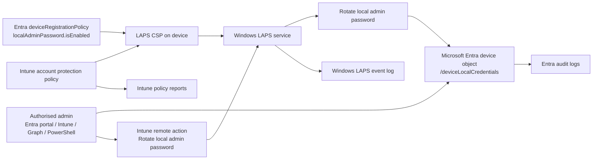
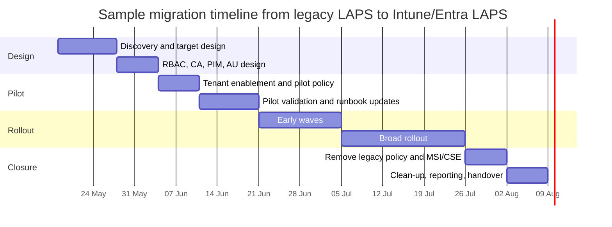

# Windows LAPS for Intune and Entra Joined Enterprises

## Executive summary

As of 2026, the recommended Microsoft-native way to manage local administrator credentials on Microsoft Intune-managed, Microsoft Entra joined devices is **Windows LAPS** backed up to **Microsoft Entra ID**, with policy delivered through **Intune Endpoint security > Account protection**. In this design, Windows rotates one managed local administrator account per device, stores the secret on the device object in Entra ID, encrypts it before persistence, and lets authorised admins recover it through the Entra portal, Intune portal, Microsoft Graph, or the Windows LAPS PowerShell module. For Entra-only estates, this is materially simpler than legacy GPO-based LAPS because it avoids on-premises schema dependencies and uses Entra RBAC, audit logs, and Intune reporting. citeturn4view3turn4view9turn22view0turn4view6turn16view0turn12search19

The most important operational facts are easy to miss. First, **Intune’s CSP-based LAPS policy takes precedence** over GPO or legacy LAPS settings, so mixed-management is a common source of conflicts if you do not rationalise policies first. Second, **Entra backup is one-directory-only**: a device can back up to Entra or Active Directory, not both. Third, **if the Entra device object is deleted, the stored LAPS credential is lost and cannot be recovered from Entra**. Fourth, **manual password recovery and manual rotation are governed by different control planes**: password read rights are Entra RBAC, while the Intune “Rotate local admin password” action needs a **custom Intune role** because no built-in Intune role includes that remote task permission. citeturn34view1turn7view8turn33view3turn14view0turn14view1

For 2026 estates, Microsoft’s strongest forward-looking guidance is to prefer **automatic account management mode** on **Windows 11 24H2 and later**, ideally with a **custom, LAPS-managed account** rather than the built-in Administrator account. Automatic mode can create and manage the account, optionally keep it disabled until needed, and randomise its name; Microsoft explicitly recommends preferring this mode except where you truly need custom account configuration that automatic mode cannot provide. citeturn25view0turn33view3

The main limitations remain strategic rather than cosmetic. Windows LAPS does **not** replace endpoint privilege management, just-in-time application elevation, or broader PAM. It solves a specific problem: **unique, rotated, recoverable local administrator secrets**. It should therefore sit alongside Conditional Access, PIM, EDR, BitLocker, device lifecycle controls, and—where needed—third-party endpoint PAM. It is also not a substitute for Microsoft Entra Password Protection, which protects **user-chosen passwords**, not local admin secrets on Windows devices. citeturn13view0turn18view1turn38view4turn38view0

## Scope, assumptions, and Microsoft pages consulted

This report assumes a general enterprise estate rather than a specific size, and focuses on **Windows client devices that are Intune-managed and Microsoft Entra joined**, while noting hybrid-joined behaviour where it materially affects deployment or migration. Windows LAPS is available on supported Windows 10 and Windows 11 builds that received the April 11, 2023 updates and later, while newer features such as **automatic account management** and **passphrase-related settings** require **Windows 11 24H2 or later**. Intune support requires **Microsoft Intune Plan 1** and Entra support for LAPS in this scenario can be used with **Microsoft Entra ID Free**. citeturn27search1turn5search2turn4view6turn25view0

### Microsoft pages consulted

All Microsoft-hosted pages directly consulted during research are listed below.

- **Overview of Windows LAPS with Microsoft Intune**. citeturn2view0
- **Deploy Intune policies to manage Windows LAPS**. citeturn2view1
- **Reports for LAPS policy in Intune**. citeturn16view0
- **Windows LAPS overview**. citeturn2view5
- **Windows LAPS architecture**. citeturn2view6
- **Configure policy settings for Windows LAPS**. citeturn7view0
- **LAPS CSP**. citeturn7view1
- **Use Windows LAPS event logs**. citeturn7view2
- **Windows LAPS troubleshooting guidance**. citeturn10view3
- **Get started with Windows LAPS and Microsoft Entra ID**. citeturn22view0
- **Use Windows Local Administrator Password Solution with Microsoft Entra ID**. citeturn2view4
- **Windows LAPS account management modes**. citeturn25view0
- **Windows LAPS frequently asked questions**. citeturn7view8
- **Get started with Windows LAPS in legacy Microsoft LAPS emulation mode**. citeturn28view0
- **Migrate to Windows LAPS from legacy LAPS**. citeturn28view1turn29view0
- **Get-LapsAADPassword**. citeturn11view3turn11view4
- **Get-LapsDiagnostics**. citeturn7view7
- **Invoke-LapsPolicyProcessing**. citeturn7view6
- **List deviceLocalCredentialInfo**. citeturn11view0
- **Get deviceLocalCredentialInfo**. citeturn13view0
- **deviceLocalCredential resource type**. citeturn11view2
- **Get deviceRegistrationPolicy**. citeturn21view1
- **Update deviceRegistrationPolicy**. citeturn21view0
- **Learn about the audit logs in Microsoft Entra ID**. citeturn7view3
- **Microsoft Entra audit log activity reference**. citeturn7view4
- **Microsoft Entra built-in roles**. citeturn17search5turn19view3turn19view4turn19view5
- **Device management permissions for Microsoft Entra custom roles**. citeturn18view4
- **Administrative units in Microsoft Entra ID**. citeturn18view2
- **Restricted management administrative units in Microsoft Entra ID**. citeturn18view6
- **Require MFA for administrators with Conditional Access**. citeturn18view0
- **Plan for mandatory Microsoft Entra multifactor authentication**. citeturn18view3
- **What is Microsoft Entra Privileged Identity Management**. citeturn18view1
- **Plan a Privileged Identity Management deployment**. citeturn18view5
- **Microsoft Entra ID Governance licensing fundamentals**. citeturn39view0
- **LAPS authentication on Teams Rooms on Windows**. citeturn16view1
- **Microsoft Entra plans and pricing**. citeturn39view1
- **Pricing for Azure Key Vault**. citeturn38view3
- **Microsoft Entra Password Protection**. citeturn38view4

### Additional high-quality sources consulted

After covering Microsoft sources, I also consulted the following English-language primary or high-quality sources.

- **NIST SP 800-63B** for current password and passphrase guidance. citeturn40search0
- **MITRE ATT&CK T1550.002** and **CISA** material for pass-the-hash risk context. citeturn40search16turn40search1
- **EFF Deep Dive: EFF’s New Wordlists for Random Passphrases**, which Microsoft cites as the basis for Windows LAPS passphrase lists. citeturn40search2turn40search11
- **CyberArk Endpoint Privilege Manager** product documentation, as a representative third-party endpoint PAM/EPM reference. citeturn38view0
- **BeyondTrust Password Safe pricing** page, as a representative quote-based third-party PAM pricing reference. citeturn38view1

## Architecture and how Windows LAPS works

Windows LAPS architecture has a few essential moving parts: the **managed Windows device**, the **policy source** such as Intune via the **LAPS CSP**, the **directory** that stores the password, and the **administrative interfaces** used to retrieve or rotate it. In Entra mode, the managed password is stored on the **Microsoft Entra device object**, and Windows LAPS authenticates to Entra using the **device identity** of the managed device. Microsoft states that data stored in Entra is already highly secure, and that the password gets an **additional encryption layer before persistence**, which is removed only for authorised clients. citeturn4view1turn4view3

In policy terms, LAPS is deterministic. Microsoft documents four policy roots—**LAPS CSP**, **LAPS Group Policy**, **LAPS Local Configuration**, and **Legacy Microsoft LAPS**—and Windows LAPS evaluates them **top-down**, activating the first root that contains at least one explicitly defined setting. In practice, this means that as soon as Intune writes any LAPS CSP setting, the **CSP root wins** and older GPO or legacy settings are ignored. This is why Microsoft repeatedly warns against overlapping sources and conflicting policies. citeturn34view1turn34view2turn4view9

For Entra-backed deployments, only a **subset** of LAPS settings applies: `BackupDirectory`, `PasswordAgeDays`, `PasswordComplexity`, `PasswordLength`, `PassphraseLength`, `AdministratorAccountName`, `PostAuthenticationResetDelay`, `PostAuthenticationActions`, and the `AutomaticAccountManagement*` settings on supported builds. Active Directory-specific knobs such as AD encryption principals and AD password history do not apply in Entra mode. At minimum, `BackupDirectory` must be set to **1**, meaning “back up the password to Microsoft Entra only”. citeturn22view0turn34view1turn9view0

The runtime model is also important. Windows LAPS uses a **background task that wakes every hour**; it is **not** a normal Scheduled Task and is **not configurable**. In the Entra scenario, the device does **not poll Entra** for expiry. Instead, the current password expiry time is maintained **locally** on the device. That design is why changing `PasswordAgeDays` does **not** immediately rotate the current secret, and why Microsoft explicitly notes that Entra mode does **not** support expiring the stored password by editing a cloud-side timestamp in the way AD mode can. If you need an immediate change, you must use **manual rotation**. citeturn4view2turn9view6turn8view1turn23view0



The diagram above reflects Microsoft’s documented architecture, policy flow, Intune management pattern, and the distinct monitoring surfaces on the device, in Intune, and in Entra ID. citeturn4view1turn22view0turn16view0turn7view2turn7view3

One further 2026-era architectural choice matters a lot: **manual** versus **automatic account management**. In manual mode, LAPS only manages the password and the organisation must create and maintain the target local account. In automatic mode, available on **Windows 11 24H2 and later**, LAPS can create and fully manage the account, including enable/disable state and optional name randomisation. Microsoft says manual mode is still useful where the target account needs unique configuration, but **recommends preferring automatic mode** in most cases, ideally with a custom account and the built-in Administrator left unused and disabled. citeturn25view0turn9view5

## Deployment and configuration for Intune and Entra joined devices

For **Microsoft Entra joined** devices, Microsoft’s preferred deployment path is:

1. **Enable LAPS tenant-wide in Entra ID**.  
2. **Create a single Intune LAPS policy** in **Endpoint security > Account protection**.  
3. **Assign it to device groups, not user groups**.  
4. **Let the device rotate and back up the password**, then confirm in Intune, Entra, or the device event log. citeturn20search3turn4view7turn4view9turn4view10turn22view0

This is the step-by-step sequence I recommend in an enterprise tenant:

### Prepare the platform

Confirm that the devices are **Microsoft Entra joined**, not merely **Microsoft Entra registered / workplace joined**, because LAPS in this scenario is supported only for Entra joined or hybrid joined devices. Confirm that the OS is on a supported Windows build and, if you want automatic account management or passphrase features, that the target ring is **Windows 11 24H2 or later**. Confirm licensing: **Intune Plan 1** plus **Microsoft Entra ID Free** is sufficient for the base LAPS scenario in Intune. citeturn32view4turn4view6turn27search1turn5search2turn25view0

### Enable tenant-wide LAPS in Entra ID

In the Entra admin centre, go to **Identity > Devices > Overview > Device settings** and set **Enable Local Administrator Password Solution (LAPS)** to **Yes**. For Entra-joined devices, this tenant-wide toggle is required before devices can post new passwords to Entra ID. Microsoft also exposes the same setting through **`deviceRegistrationPolicy.localAdminPassword.isEnabled`** in Microsoft Graph. The Graph API uses **`PUT /policies/deviceRegistrationPolicy`** and requires a **full updatable object**, not a tiny partial patch, so read the current object first and then update it carefully. citeturn22view0turn21view0turn21view1

A minimal Graph example, abbreviated for readability, looks like this:

```http
PUT https://graph.microsoft.com/v1.0/policies/deviceRegistrationPolicy
Content-Type: application/json

{
  "userDeviceQuota": 2,
  "multiFactorAuthConfiguration": "notRequired",
  "azureADRegistration": {
    "isAdminConfigurable": false,
    "allowedToRegister": {
      "@odata.type": "#microsoft.graph.noDeviceRegistrationMembership"
    }
  },
  "azureADJoin": {
    "isAdminConfigurable": true,
    "allowedToJoin": {
      "@odata.type": "#microsoft.graph.allDeviceRegistrationMembership"
    },
    "localAdmins": {
      "enableGlobalAdmins": true,
      "registeringUsers": {
        "@odata.type": "#microsoft.graph.enumeratedDeviceRegistrationMembership",
        "users": [],
        "groups": []
      }
    }
  },
  "localAdminPassword": {
    "isEnabled": true
  }
}
```

That snippet is based on Microsoft’s v1.0 Graph examples for reading and updating `deviceRegistrationPolicy`; the critical field for LAPS is `localAdminPassword.isEnabled`. The least-privileged Graph permission for updating it is **`Policy.ReadWrite.DeviceConfiguration`**, and Microsoft lists **Cloud Device Administrator** as the least-privileged supported delegated role for that operation. citeturn21view0turn21view1

### Create the Intune LAPS policy

In Intune, create a policy at **Endpoint security > Account protection > Create policy**, choosing **Windows 10 and later** and **Local admin password solution (Windows LAPS)**. Microsoft says this profile configures Windows LAPS through the **LAPS CSP** and that the CSP settings **override** existing settings from GPOs or legacy Microsoft LAPS. Assign it to **device groups**, not user groups, because Microsoft warns that user-based assignments can follow the user between machines and create inconsistent behaviour and conflicts. citeturn4view9turn4view10turn33view3

### Choose the account strategy

For existing mixed-version estates, the simplest and safest default is:

- Use the **built-in local administrator account** only if you must support older builds or legacy processes.
- Prefer **automatic account management** on **Windows 11 24H2+**, target a **new custom account**, and consider **randomised names** and a **disabled-by-default account** for higher-assurance environments. citeturn25view0turn33view3

If you stay in manual mode and specify `AdministratorAccountName`, Microsoft is clear that the account must already exist; Windows LAPS does **not** create it for you on down-level builds. citeturn9view6turn22view0

### Configure the policy settings

The table below is a **sample enterprise baseline**, not a Microsoft default. It stays within Microsoft’s documented bounds and reflects a practical support-versus-security trade-off.

| Setting | Standard enterprise baseline | Higher-assurance 24H2+ baseline | Notes |
|---|---:|---:|---|
| BackupDirectory | `1` | `1` | Entra only |
| PasswordAgeDays | `30` | `14` | Entra minimum is `7`; use manual rotate for emergencies |
| PasswordComplexity | `5` | `8` | `5` is improved-readability complex password; `8` is short-word passphrase with unique prefixes |
| PasswordLength | `20` | — | Applies when using complexity `1-5` |
| PassphraseLength | — | `6` | Applies when using complexity `6-8`; supported on 24H2+ |
| PostAuthenticationResetDelay | `8` | `4` | Hours after successful use of the managed account |
| PostAuthenticationActions | `3` | `11` | `11` needs 24H2+; more aggressive cleanup |
| AutomaticAccountManagementEnabled | `false` | `true` | Prefer `true` on 24H2+ where feasible |
| AutomaticAccountManagementTarget | — | `1` | `1` = new custom account |
| AutomaticAccountManagementEnableAccount | — | `0` or `1` | `0` is stronger but adds support friction |
| AutomaticAccountManagementRandomizeName | — | `true` | Harder to target with broad spraying |

These recommended values stay within Microsoft’s supported ranges and options: Entra backup requires `BackupDirectory=1`; `PasswordAgeDays` in Entra mode is constrained to **7–365**; `PasswordLength` is **8–64**; `PassphraseLength` is **3–10** on supported builds; `PostAuthenticationResetDelay` is **0–24** hours; and valid post-authentication actions are **1, 3, 5, and 11**, with **11** requiring **Windows 11 24H2 / Windows Server 2025 or later**. Microsoft also says complexity values **1–3** exist mainly for backward compatibility and recommends **4** at minimum when using password mode. citeturn9view0turn9view1turn9view2turn9view3turn9view4turn9view5turn10view0turn10view1

If you want a **CSP-equivalent JSON blueprint**—useful for design documentation, non-Intune MDM tools, or custom OMA-URI implementations—the settings conceptually look like this:

```json
[
  {
    "omaUri": "./Device/Vendor/MSFT/LAPS/Policies/BackupDirectory",
    "dataType": "integer",
    "value": 1
  },
  {
    "omaUri": "./Device/Vendor/MSFT/LAPS/Policies/PasswordAgeDays",
    "dataType": "integer",
    "value": 30
  },
  {
    "omaUri": "./Device/Vendor/MSFT/LAPS/Policies/PasswordComplexity",
    "dataType": "integer",
    "value": 5
  },
  {
    "omaUri": "./Device/Vendor/MSFT/LAPS/Policies/PasswordLength",
    "dataType": "integer",
    "value": 20
  },
  {
    "omaUri": "./Device/Vendor/MSFT/LAPS/Policies/PostAuthenticationResetDelay",
    "dataType": "integer",
    "value": 8
  },
  {
    "omaUri": "./Device/Vendor/MSFT/LAPS/Policies/PostAuthenticationActions",
    "dataType": "integer",
    "value": 3
  }
]
```

That JSON is an **illustrative CSP-equivalent** example rather than a guaranteed export from the current Intune Graph API. Microsoft’s preferred and fully supported Intune experience for Entra-joined devices is still the **Endpoint security / Account protection / Windows LAPS** profile, because that path gives you policy reporting and the portal rotation action. citeturn7view1turn4view9turn16view0

### Force processing and verify success

After assignment, Intune will attempt to notify the device to check in. If you do not want to wait for the normal cycle, Microsoft provides **`Invoke-LapsPolicyProcessing`** to trigger processing locally. In the Entra scenario, a successful password upload is recorded on the device as **event ID 10029**, and a successful local account update is **event ID 10020**. In Intune or Entra, you should then see the account name, SID, and—if your role allows it—the current password and next rotation time. citeturn7view6turn22view0turn31view0turn4view11

## Access control, Conditional Access, monitoring, and incident response

The most important governance point is that **Windows LAPS recovery rights are not the same thing as Intune device administration rights**. Microsoft splits this model three ways:

- **Create and manage LAPS policy** in Intune: use Intune RBAC such as **Endpoint Security Manager** or a custom role with the required **Security baselines** rights. citeturn4view8
- **Read LAPS metadata or passwords**: use **Entra RBAC** permissions such as `microsoft.directory/deviceLocalCredentials/standard/read` and `microsoft.directory/deviceLocalCredentials/password/read`. citeturn14view0turn32view4turn32view6turn32view7
- **Manually rotate the password from Intune**: grant the Intune permissions **Managed devices: Read**, **Organization: Read**, and **Remote tasks: Rotate Local Admin Password**—and Microsoft explicitly says this rotation right is **not included in any built-in Intune role**, so you must create a **custom Intune role** for it. citeturn14view0turn14view5

For the **portal/UI** experience, Microsoft’s own Intune documentation states that built-in password recovery rights are held by **Cloud Device Administrator** and **Intune Administrator**, while metadata can also be viewed by roles such as **Security Reader**, **Helpdesk Administrator**, and **Security Administrator**. For **custom roles**, you can grant the exact Entra device-local-credential actions; for **scope reduction**, you can place devices in an **administrative unit** and assign a device-management role such as **Cloud Device Administrator** at AU scope. If you have especially sensitive endpoints, **restricted management administrative units** can block even tenant-scoped administrators from modifying matched objects without an explicit scoped assignment. citeturn33view3turn32view4turn32view5turn18view2turn18view6

A useful 2026 design pattern is therefore:

1. **Use AU-scoped recovery roles** for regional or business-unit segregation.  
2. **Use PIM** to make those roles eligible rather than permanently active.  
3. **Use a separate, custom Intune role** for manual rotation, given only to operational staff who genuinely need it. citeturn18view1turn18view5turn14view0

This separation is especially important because another Entra role exists that many organisations misuse: **Microsoft Entra Joined Device Local Administrator**. That role adds users to the **local Administrators group on all Microsoft Entra joined devices**. It is not a password recovery role, and broad membership effectively bypasses the least-privilege intent of LAPS. In most Entra-joined estates, keep membership of that role close to zero. citeturn19view5

### Conditional Access and PIM considerations

Microsoft documents that **Conditional Access policies for local administrator password recovery can be scoped to the built-in roles** that authorise password recovery, and specifically points admins to the **Require MFA for administrators** pattern. However, Microsoft also notes a limitation: for this LAPS recovery scenario, **custom roles and administrative unit-scoped roles are not supported** as the role selector for the LAPS-specific Conditional Access pattern. citeturn32view1turn18view0

That limitation matters more in 2026 because Microsoft’s own **mandatory MFA** rollout now covers the **Microsoft Entra admin centre** and **Intune admin centre** for portal CRUD operations, and phase 2 extends MFA enforcement to **CLI, PowerShell, mobile app, IaC tools, and REST API endpoints for create/update/delete operations**, while **read operations are not covered** by that phase 2 API rule. In practical terms: the portals already have a strong MFA baseline, but **Graph-based read workflows** for password retrieval still need deliberate design, least-privileged permissions, and careful app governance; do not assume “Microsoft now requires MFA everywhere” fully solves the risk for password-retrieval automation. citeturn18view3turn13view0

For role governance, **PIM** is a very strong fit. Microsoft describes PIM as providing **time-based and approval-based activation**, and requires **Microsoft Entra ID P2** or **Microsoft Entra ID Governance** licences for users who are eligible, approve activations, or perform PIM access reviews. As of the Ireland pricing page consulted, **Entra ID P2** is listed at **€7.80 user/month, paid yearly**. citeturn18view1turn39view0turn39view1

### Monitoring and logging

Microsoft gives you three monitoring layers:

**Device-side Windows events.** Windows LAPS has a dedicated **Operational** event channel. Key IDs include **10003** and **10004/10005** for processing start and success/failure, **10022** for Entra-mode policy configuration, **10029** for successful upload to Entra, **10020** for successful local account update, **10031** for blocked external password modification attempts, and **10041–10044** for post-authentication detection and completion. In automatic account management mode, tampering events **10101–10104** cover blocked modification, security descriptor change, deletion, or removal from the local Administrators group. citeturn10view2turn31view4turn31view5turn25view0

**Intune policy reporting.** Intune’s LAPS reports show device assignment status, per-setting status, errors, conflicts, and the source profiles causing those conflicts. Microsoft is explicit that LAPS conflicts can prevent the backup of the managed local admin account and password to the tenant directory, which is why the “one device, one LAPS policy” principle matters operationally. citeturn16view0turn30search5

**Entra audit logging.** When Intune is managing Windows LAPS, the following actions are audited in Entra ID: **automatic password rotation**, **manual password rotation through device action**, and **requests to view the password**. Microsoft’s Entra LAPS documentation also names the two audit activities you can filter for: **Update device local administrator password** and **Recover device local administrator password**. citeturn16view0turn32view3turn16view1turn7view3turn7view4

### Graph and PowerShell automation

Microsoft Graph exposes the secret store through **`/directory/deviceLocalCredentials`**. Listing device entries uses **`DeviceLocalCredential.ReadBasic.All`** or **`DeviceLocalCredential.Read.All`** and supports standard OData query features and pagination. To retrieve the actual password, you call **`GET /directory/deviceLocalCredentials/{deviceId}?$select=credentials`**; Microsoft states that the response includes **`passwordBase64`**, so callers must decode it before use. For delegated access, Graph narrows least-privileged clear-text retrieval to supported roles such as **Cloud Device Administrator** or **Intune Service Administrator**. citeturn11view0turn13view0turn11view2

A practical PowerShell pattern looks like this:

```powershell
# Read-only metadata
Connect-MgGraph -Scopes "Device.Read.All","DeviceLocalCredential.ReadBasic.All"
Get-LapsAADPassword -DeviceIds "PC-001"

# Clear-text recovery for authorised break/fix
Connect-MgGraph -Scopes "Device.Read.All","DeviceLocalCredential.Read.All"
Get-LapsAADPassword -DeviceIds "PC-001" -IncludePasswords -AsPlainText

# Force immediate local rotation on the device
Reset-LapsPassword

# Force policy processing on the device
Invoke-LapsPolicyProcessing
```

Microsoft’s own documentation says `Get-LapsAADPassword` is a wrapper around Microsoft Graph and supports both metadata-only reads and clear-text password retrieval; the cmdlet can also request **history** when available. `Reset-LapsPassword` immediately rotates the currently managed local account regardless of normal expiry, while `Invoke-LapsPolicyProcessing` tells LAPS to process the active policy at once. citeturn11view3turn11view4turn23view0turn7view6

### Incident response playbook

For LAPS-specific incidents, the most useful response pattern is:

| Scenario | Immediate action | Evidence to check | Likely fix |
|---|---|---|---|
| Password viewed unexpectedly | Check Entra audit logs for **Recover device local administrator password** and the actor | Entra audit log, Intune audit trail | Rotate immediately via Intune device action or `Reset-LapsPassword`; review role assignments |
| Rotation failed | Check Intune conflict/error status and device-side event logs | Intune LAPS report, event IDs **10005**, **10028**, **10032** | Fix Entra enablement, device registration, or policy conflicts; validate `dsregcmd /status` |
| Device stopped backing up | Confirm device still exists and is enabled in Entra | Entra device record, Intune view, event log | Re-enable or repair registration; policies do not apply to disabled/deleted objects |
| Deleted device object | Treat current cloud-stored credential as permanently lost | Entra device lifecycle logs | Use other recovery channels or reimage; prevent deletion before operational exit criteria are complete |

That playbook is directly grounded in Microsoft’s audit events, LAPS troubleshooting guidance for **10028** and **10032**, and Microsoft’s warning that deleting the Entra device object destroys the stored credential. citeturn16view0turn10view3turn10view4turn33view3

## Security value, limitations, operational impact, scalability, and compliance

The clear security win from LAPS is that it changes the local admin secret from a **reused enterprise-wide weakness** into a **per-device, rotated credential**. Microsoft explicitly positions Windows LAPS as protection against **pass-the-hash** and **lateral traversal**, and that aligns with MITRE ATT&CK and CISA descriptions of pass-the-hash as a lateral movement technique that works without the clear-text password once a hash is stolen. Unique per-device local admin secrets do not eliminate local compromise, but they sharply reduce the blast radius of a stolen credential. citeturn4view13turn40search16turn40search1

The second major security benefit is **break/fix recoverability with control**. Microsoft calls out the ability to recover otherwise inaccessible devices, while also protecting the managed account against unauthorised password changes and logging blocked modification attempts. In automatic mode, LAPS can also keep the account disabled or use randomised names, which Microsoft says makes password spray and target discovery harder, though at the cost of additional support friction. citeturn4view13turn31view0turn25view0

The main limitations for Entra-only enterprises are operationally important:

- Windows LAPS supports **one managed local admin account per device**. citeturn4view9turn33view3
- Devices can back up to **Entra or AD, not both**. citeturn7view8turn27search1
- **Microsoft Entra registered / workplace-joined** devices are not supported. citeturn32view4turn4view7
- If a custom account name is specified in manual mode and the account does not exist, the device is effectively unmanaged until that is corrected. citeturn9view6turn33view3
- **Disabled devices** in Entra do not rotate or back up passwords. citeturn33view3
- If the **device object is deleted**, the stored password is lost and cannot be recovered from Entra. citeturn14view3turn33view3
- LAPS is **disabled in Safe Mode / non-normal boot modes**, so you should not expect recovery or backup logic to help there. citeturn30search0
- Post-authentication actions can forcibly sign out sessions or reboot devices, and Microsoft warns that these actions can cause **data loss**. citeturn10view0turn10view1
- Microsoft cautions that a malicious user who already has administrative control on the device can ultimately **circumvent or prevent** post-authentication mechanisms. citeturn10view0turn10view1

From an operational viewpoint, three issues dominate:

**Policy conflict management.** Intune says the LAPS CSP supports only a single effective configuration for each setting on a device, and conflicts can stop processing or backup. That is why the safest pattern is **one LAPS policy per device** delivered through **device groups**, not user groups. citeturn30search5turn4view10

**Support-process change.** If you adopt **automatic account management**, **disabled accounts**, **randomised names**, or aggressive **post-authentication actions**, you will gain security and lose convenience. That trade-off is worthwhile in most high-assurance estates, but only if operations teams are trained and break-glass runbooks are updated. This is an inference from Microsoft’s own documentation, which explicitly describes the security-versus-friction trade-off for disabled accounts and randomised account names. citeturn25view0

**Device lifecycle coupling.** Because Entra deletion destroys the stored password, LAPS should be integrated with device retirement and incident workflows. A mature enterprise process should prevent deletion of the device object until the device is wiped, retired, or no longer needs support access. That is an operational recommendation derived from Microsoft’s documented deletion behaviour. citeturn33view3

At scale, Windows LAPS in Entra mode is operationally attractive because it requires **no on-premises schema**, **no DC-side password write path**, and uses standard Intune assignment/reporting plus Graph for enumeration and automation. Microsoft’s list API supports **query parameters and pagination**, Intune policy reports surface estate-wide conflicts, and Entra offers a tenant-wide password recovery list view. For Entra-native organisations, this is materially simpler to run than legacy GPO/MSI LAPS. citeturn11view0turn16view0turn32view3

On compliance, the right way to frame LAPS is not “this makes you compliant”, but “this gives you evidence and control for common privileged-access objectives”. It supports **least privilege**, **credential uniqueness**, **periodic rotation**, **segregation of duties**, **scoped administrative access**, and **auditable recovery/rotation events**. Those are common control objectives across many frameworks even if the exact mapping differs by scheme. This is an inference based on Microsoft’s RBAC, auditing, PIM, and recovery features, together with broader least-privilege and passphrase guidance from NIST, CISA, and vendor endpoint PAM literature. citeturn14view0turn16view0turn18view1turn18view2turn40search0turn38view0

### Security risk assessment and mitigations

| Risk | Why it matters | Mitigation |
|---|---|---|
| Over-broad password recovery roles | Too many people can read local admin secrets | Restrict read rights to Cloud Device Administrator / Intune Administrator only where necessary; use custom roles for metadata-only access; scope device sets with administrative units; use PIM for JIT activation. citeturn33view3turn32view4turn18view2turn18view1 |
| Policy conflicts | Backup can silently fail or become inconsistent | Keep one LAPS policy per device, assign to device groups, monitor Intune’s conflict reports. citeturn30search5turn16view0 |
| Device object deletion | Password becomes unrecoverable from Entra | Add lifecycle guardrails so deletion is the final step, not an early cleanup action. citeturn33view3 |
| Break/fix accounts left enabled all the time | Larger attack surface for spray and discovery | On 24H2+, prefer automatic account management with a custom account, randomised names, and disabled-by-default state where support model allows. citeturn25view0 |
| API-based read automation | Graph clear-text retrieval can become a standing secret-extraction path | Avoid application permissions for password read unless truly necessary; prefer human JIT access via PIM and portal recovery. citeturn13view0turn11view0turn18view1 |
| Excessive faith in post-authentication actions | A local admin on-box can still interfere with controls | Treat post-auth actions as exposure-limiting controls, not absolute containment; pair with EDR, device isolation, and fast rotation. citeturn10view0turn10view1 |
| Broad use of the Entra Joined Device Local Administrator role | Effectively grants standing local admin on all Entra-joined devices | Keep this role tightly restricted or eliminate it where LAPS is the intended break-glass pattern. citeturn19view5 |

## Comparison with alternatives

The most important comparison point is conceptual: **LAPS is a local admin credential rotation and recovery control**, not a full privileged-access platform. Some “alternatives” are really **complements** rather than substitutes.

| Option | What it solves well | Key drawbacks | Cost signal | Best fit |
|---|---|---|---|---|
| **Windows LAPS with Intune + Entra** | Native Windows local admin password rotation, Entra backup, Intune deployment/reporting, Entra auditing, Graph automation. citeturn4view6turn4view9turn16view0turn13view0 | One account per device; no multi-directory backup; no app elevation/JIT privilege brokering; Entra object deletion loses the secret. citeturn4view9turn7view8turn33view3 | Included in supported Windows; Intune deployment needs **Intune Plan 1** and **Entra ID Free or higher**. citeturn4view6turn27search1 | Default choice for Microsoft-centric enterprises needing secure break/fix local admin access |
| **Third-party endpoint PAM / EPM** such as **CyberArk Endpoint Privilege Manager** or **BeyondTrust Password Safe** | Broader endpoint privilege controls: local admin removal, just-in-time elevation, application control, richer cross-platform capabilities, and deeper privileged workflow. CyberArk explicitly positions EPM around removing local admin rights and enforcing least privilege across Windows, macOS and Linux. citeturn38view0 | Higher complexity, extra agenting/integration, broader process change, and usually a larger programme than simply replacing LAPS. | Public pricing is often **quote-based**; BeyondTrust’s pricing page directs buyers to contact sales for a custom quote. citeturn38view1 | Organisations that need more than secret rotation: elevation workflows, application control, privileged session governance, or multi-OS privilege management |
| **Cloud-managed secrets** such as **Azure Key Vault** | Strong for **application** and **automation** secrets, cryptographic keys, and certificates. Azure Key Vault is a general-purpose secret and key platform with usage-based pricing. citeturn35search13turn38view3 | Not a native Windows local admin lifecycle solution; no built-in one-click break/fix local account recovery workflow on endpoints. | Consumption-based Azure pricing. citeturn38view3 | App and service secret storage; complementary to LAPS, not a direct replacement |
| **Microsoft Entra Password Protection** | Blocks weak or banned **user-chosen passwords** and variants, including on-prem AD password changes where deployed correctly. citeturn38view4 | Does **not** rotate or escrow local admin passwords on Windows endpoints, so it is not a substitute for LAPS. Partial on-prem deployment is explicitly not secure beyond testing. citeturn38view4 | Part of broader Entra password security capability; not separately evaluated here as a LAPS replacement | Complementary user-password hygiene control |
| **Microsoft Entra PIM** | Just-in-time activation, approval workflows, time-bounded role assignment, and governance over **who** can perform password recovery or rotation. citeturn18view1turn18view5 | Does not itself create, rotate, or store local admin passwords. It governs access to the tools that do. | Requires **Entra ID P2** or **Entra ID Governance**; Entra ID P2 starts at **€7.80/user/month** on the Ireland pricing page consulted. citeturn39view0turn39view1 | Essential complement where LAPS access must be just-in-time, approved, and reviewed |

The practical conclusion is simple: if your problem statement is specifically **“we need secure, unique local admin passwords on Windows endpoints, stored in Entra and recoverable by support”**, Windows LAPS is the right first-line control. If your problem statement expands to **“we need to remove most standing admin, broker elevation, govern privileged apps, and handle multiple OS types”**, third-party endpoint PAM or EPM becomes more appropriate—often with LAPS still retained as the Windows local account safety net. citeturn38view0turn4view13

## Migration plan, best-practice checklist, and conclusion

Microsoft’s own migration guidance for legacy Microsoft LAPS recognises two patterns: an **immediate transition** and a **transient side-by-side coexistence** approach. The immediate path is straightforward: **disable or remove the legacy policy**, **apply Windows LAPS policy**, **monitor for a successful transition**, then **remove the legacy software**. The side-by-side path is slower and safer in some estates, but it requires a **different local account**, because having both Windows LAPS and legacy LAPS target the **same account is unsupported**. citeturn28view1turn29view0

A subtle but important migration detail is that **Windows LAPS is built in and always active** once policy is applied. Microsoft warns that this can be disruptive during OS deployment or migration because the managed account password can change **immediately** when a new Windows LAPS policy lands. The same “always on” behaviour is also why legacy emulation mode can suddenly start enforcing a legacy policy if its criteria are met. citeturn30search0turn28view0

### Recommended phased migration plan

For an enterprise moving from **legacy GPO-based LAPS** to **Intune/Entra-managed LAPS**, I recommend the following phased approach:

| Phase | Indicative duration | Tasks | Success criteria |
|---|---|---|---|
| Discovery and design | 1–2 weeks | Inventory existing local admin accounts, legacy GPOs/MSI footprint, device join states, support workflows, and privileged roles; decide whether the target account will be built-in or automatic custom on 24H2+ | Documented target design and scope |
| Tenant and RBAC foundation | 1 week | Enable Entra tenant LAPS; create Intune custom rotate role; design Entra recovery roles, AUs, CA, and PIM model | Pilot admins can retrieve and rotate safely |
| Pilot | 2 weeks | Apply one Intune LAPS policy to a pilot device group; verify **10029**, Intune reporting, Entra audit logs, and support runbooks | Stable rotations and recoveries with no unresolved conflicts |
| Coexistence or cut-over | 2–4 weeks | For immediate migration, remove legacy policy while applying Intune policy; for coexistence, create a second local account and have Windows LAPS manage that instead | Pilot and early-wave devices demonstrably under Windows LAPS only |
| Estate rollout | 2–6 weeks | Expand by region / business unit / ring; monitor conflicts and audit events; keep deletion/runbook guardrails in place | Estate-wide coverage with low exception rate |
| Legacy closure | 1–2 weeks | Uninstall legacy MSI / unregister `AdmPwd.dll` where needed; remove extra coexistence accounts; delete legacy GPOs and ADMX dependence | No active legacy enforcement remains |

That sequence is aligned with Microsoft’s migration article, including the coexistence rule that a second local account is required if both legacy and Windows LAPS must temporarily coexist. Microsoft also documents the removal steps for legacy MSI or manually registered `AdmPwd.dll`. citeturn28view1turn29view0



The timeline above is a **sample** rather than a Microsoft-prescribed schedule, but the task order follows Microsoft’s migration and monitoring guidance. citeturn28view1turn29view0

### Best-practice checklist for 2026

- **Prefer Intune-delivered LAPS CSP policy** for Entra-joined estates; use GPO or legacy emulation only for migration or non-Intune edge cases. citeturn22view0turn7view8turn28view0
- **Use one LAPS policy per device**, assigned to **device groups**. citeturn4view10turn30search5
- **Enable tenant-wide Entra LAPS before rollout** and verify with a Graph read of `deviceRegistrationPolicy` if you automate. citeturn21view0turn21view1
- On **Windows 11 24H2+**, **prefer automatic account management**, ideally a **custom** account rather than the built-in Administrator. Microsoft recommends this except in rare cases needing bespoke account configuration. citeturn25view0
- Consider **disabled-by-default** and **randomised-name** managed accounts in higher-risk estates, but only where support runbooks are mature. citeturn25view0
- Separate duties: **password recovery = Entra RBAC**, **manual rotation = custom Intune role**, **role activation = PIM**. citeturn14view0turn18view1
- Use **Conditional Access for built-in recovery roles** and remember that **custom/AU-scoped roles are not supported** for the LAPS-specific role-scoped CA pattern. citeturn32view1
- Do not rely solely on platform defaults: **collect Entra audit logs**, **Intune reports**, and **Windows LAPS Operational logs** centrally. citeturn16view0turn7view2turn7view3
- Build a **device-deletion guardrail** so the Entra object is not deleted before operational recovery needs are over. citeturn33view3
- Avoid broad assignment of **Microsoft Entra Joined Device Local Administrator**. citeturn19view5
- Treat **Entra Password Protection** and **PIM** as complements, not replacements. citeturn38view4turn18view1

### Open questions and limitations

Two areas remain inherently less precise than the Microsoft-native parts of the analysis.

First, **third-party PAM pricing** is not transparent in the same way Microsoft licensing is; some vendors publish only **contact sales / custom quote** pricing, so the comparison table should be read as a **cost model / cost signal** comparison rather than a licence-by-licence buying guide. citeturn38view1

Second, the **sample JSON** in this report is a **CSP-equivalent policy blueprint**, not a promise that a given Intune Graph API version will accept that exact shape as a ready-made export/import payload. Microsoft’s official, stable guidance for Entra-joined endpoints is still the **Intune Endpoint security > Account protection > Windows LAPS** profile. citeturn4view9turn7view1

### Conclusion

For a modern Microsoft enterprise in 2026, **Windows LAPS with Intune policy and Entra backup should be the default control for local administrator password management on Entra-joined Windows devices**. Its architecture is mature, its deployment model is straightforward, and its strengths—native Windows integration, Entra-backed storage, auditable recovery, and clean fit with Intune, RBAC, PIM, and Graph—make it the most cost-effective and supportable baseline for the scenario you described. Its limitations are real, but they are manageable if you design for them up front: **one account per device, one effective policy per device, careful role separation, device lifecycle discipline, and a clear migration away from legacy LAPS or overlapping PAM controls**. citeturn4view6turn22view0turn14view0turn16view0turn28view1