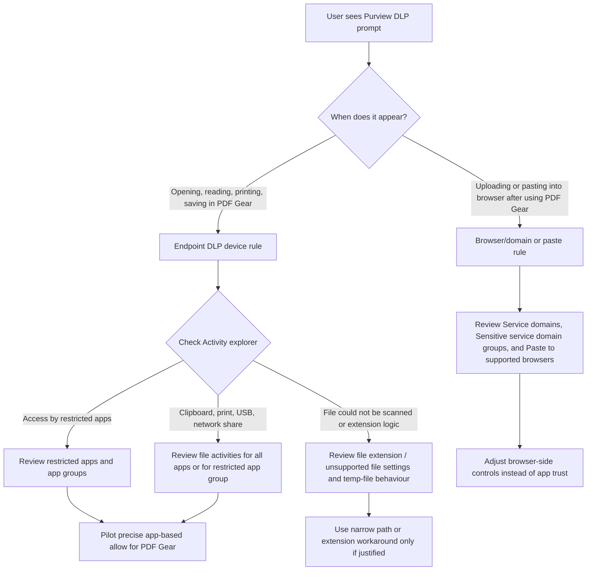

# Resolving Microsoft Purview DLP Pop-Up Prompts in PDF Gear

## Executive summary

In a Microsoft 365 Enterprise tenant, repeated Microsoft Purview data loss prevention pop-up prompts for a company-approved Windows desktop application such as PDF Gear are most likely coming from **Endpoint DLP** rules in the **Devices** location, not from SharePoint, OneDrive, or Exchange “policy tip” experiences. The most common triggers are: **Access by restricted apps**, **file activities for all apps** such as copy to clipboard, print, network share or USB actions, and **browser/domain restrictions** if users move content from PDF Gear into Edge, Chrome, or Firefox. Microsoft’s current DLP model spans two broad policy families: **Enterprise applications & devices** and **Inline web traffic**. For this use case, the relevant control surface is almost always Enterprise applications & devices → Devices. citeturn11view0turn2view2turn31view1

The most important practical finding is that Microsoft documents **Windows app matching for Endpoint DLP restricted apps by executable name only**. Microsoft explicitly says **not** to include the path to the executable on Windows; for macOS, by contrast, Microsoft documents using the full app path. I did **not** find Microsoft documentation showing publisher- or digital-signature-based matching for Windows Endpoint DLP restricted apps. In other words, for Windows, the native Purview “trusted app” pattern is **not** a publisher trust model; it is an **app group / restricted app** model based on the process executable name, combined with per-rule allow, audit, block-with-override, or block behaviour. citeturn3view0turn4view1

For PDF Gear specifically, the safest remediation path is usually:

1. **Prove which rule and activity is firing** in Activity explorer and on the affected device.
2. **Pilot a restricted app group for PDF Gear** and either allow access entirely or allow access while still controlling selected activities such as print, USB, clipboard, and network share.
3. Use **file path exclusions only as a narrowly scoped fallback** for verified PDF Gear cache or temp folders, because Microsoft states that excluded paths are **not audited** and are **not subject to DLP enforcement**, and those exclusions are global endpoint settings rather than per-policy exceptions.
4. If the pop-up appears only during browser upload or paste after users copy from PDF Gear, tune **Sensitive service domain groups**, **Service domains**, or **Paste to supported browsers** instead of changing PDF Gear itself.
5. Use **sensitivity labels** for persistent file protection where documents live in SharePoint and OneDrive, and use **Conditional Access / Intune app protection** for access control to Microsoft 365 data, while recognising that these are **not direct replacements** for suppressing Endpoint DLP prompts inside an arbitrary Win32 PDF editor. citeturn14view1turn3view0turn4view3turn31view1turn31view3turn22view4turn22view3turn22view2

My recommendation, assuming no unusual tenant design, is to start with a **pilot policy** in **simulation / test mode with notifications**, create a **PDF Gear restricted app group**, and set a policy that allows PDF Gear to open protected PDFs while preserving higher-risk controls such as USB, network share, and restricted cloud upload blocks. Avoid global extension or path exclusions for `.pdf` unless you intentionally accept a material reduction in PDF DLP coverage and investigation capability. citeturn14view4turn29view3turn4view2turn4view3

## Assumptions and scope

This report assumes the following unless you already know otherwise:

- **PDF Gear is used as a Windows desktop application** on company-managed Windows 10 or Windows 11 endpoints.
- Those endpoints are **onboarded for Endpoint DLP** through Microsoft’s device onboarding process and can sync DLP policy.
- The issue is **Purview DLP pop-up prompts for local PDF work in PDF Gear**, not Outlook oversharing pop-ups, Teams message tips, or SharePoint web policy tips.
- Licensing is sufficient for the Endpoint DLP features discussed in Microsoft 365 Enterprise, Purview Suite, or equivalent entitlements. citeturn14view3turn11view3

Two important limitations follow from the research:

- Microsoft public documentation reviewed here explains how Purview DLP should be configured, but it does **not** publish a PDF Gear-specific interoperability guide.
- In the public PDF Gear materials I reviewed, the vendor describes the Windows app, the installer, contact/support, and general security/digital-signing claims, but I did **not** find a public Purview-specific support article. That means you should verify the **exact executable name** and any **working/cache/temp paths** on your own reference device before applying an exception. citeturn17search3turn17search5turn17search1turn17search2turn17search21

## Where Purview prompts come from

Microsoft now frames DLP around two policy families: **Enterprise applications & devices** and **Inline web traffic**. Enterprise applications & devices covers Microsoft 365 workloads, Office apps, endpoint devices, non-Microsoft cloud apps, on-premises repositories, Fabric and Power BI, and some Copilot surfaces. Inline web traffic covers unmanaged app protection through Edge for Business and network data security. For a desktop PDF editor, the relevant experience is generally **Endpoint DLP** in the Devices location. citeturn11view0

Within Endpoint DLP, the documented device-side activities that commonly generate prompts or enforcement include **Access by restricted apps**, **copy to clipboard**, **copy to a removable USB device**, **copy to a network share**, **print**, **copy or move using unallowed Bluetooth app**, **copy or move using RDP**, **upload to a restricted cloud service domain**, and **paste to supported browsers**. Activity explorer can surface device-level events such as **read**, **modify**, **print**, **copy to clipboard**, **copy to network share**, and **access by an unallowed app**, which is exactly what you need when reconstructing why a user saw a prompt in PDF Gear. citeturn2view2turn14view1

Current Purview prompt-capable locations are broader than Endpoint DLP. Microsoft’s policy-tip reference shows support for prompts in Outlook on the web, Outlook for Microsoft 365, Teams messages, SharePoint/OneDrive web, Office web apps, some Office Win32 scenarios, and Win32 endpoint devices. However, **third-party cloud apps do not support DLP policy tips**, and **SharePoint / OneDrive desktop client apps do not support DLP policy tips**. For a non-Microsoft Win32 PDF editor, that again points you back to Endpoint DLP rather than the Microsoft 365 document-policy-tip experiences. citeturn11view2

A second cause of “unexpected” prompts is rule interaction. Microsoft states that when multiple endpoint rules match, Endpoint DLP applies the **aggregate of the most restrictive actions**. Microsoft also states that **restricted app group settings override restricted app list settings** and override file activities for all apps **within the same rule**. So if PDF Gear is allowed in one place but blocked by another overlapping rule or activity, users can still see enforcement. citeturn2view2turn3view0



## How app detection and exclusions really work

### App detection on Windows and macOS

For **Windows**, Microsoft documents the restricted app entry as the **executable name only**, for example `browser.exe`, and specifically says **do not include the path** to the executable. Microsoft also explains that Endpoint DLP protections trigger when a restricted app tries to access a file, whether by user action or by the application itself. For **macOS**, Microsoft documents the opposite approach: enter the app using its **full path**. citeturn3view0turn4view1

That creates an important design consequence for PDF Gear on Windows:

- **Process name**: supported and central to the Purview control model.
- **App path on Windows**: not the documented matching method for restricted apps.
- **Publisher / digital signature / signer**: I found no Microsoft documentation in the reviewed material showing these as Windows Endpoint DLP restricted-app match criteria. Treat publisher-based trusting as unsupported in native Purview Endpoint DLP unless you verify otherwise in your tenant or through Microsoft support. citeturn3view0

### Native “trusted app” behaviour in Purview

Microsoft does not present a separate Windows “trusted app” object for Endpoint DLP. Instead, the closest native pattern is:

- define **Restricted apps** and **Restricted app groups** in Endpoint DLP settings;
- then, inside the DLP rule, either:
  - **don’t restrict file activity** for that app group,
  - **apply restrictions to all activity**, or
  - **apply restrictions to specific activity**.

Microsoft also documents a pattern to **block all apps except a list of allowed apps** by defining sanctioned apps in the Restricted apps and app groups list, adding the group to the rule, selecting **Allow**, and then blocking access for apps not on the allow list. citeturn3view0turn4view0

For a company-approved PDF editor, this is the most Purview-native way to treat the application as approved. It lets you permit PDF Gear to open protected files while still retaining DLP controls on selected actions, such as blocking USB export or cloud upload. citeturn4view0turn2view2

### File path, file type, extension, and file-content logic

Microsoft’s file-path exclusions are powerful but risky. Microsoft states that files in excluded paths are **not audited**, and files created or modified there are **not subject to DLP policy enforcement**. Microsoft also notes that **unsaved file protection** can still detect and block egress activities on unsaved files even in excluded paths such as `%temp%` or `%appdata%`, so a path exclusion is not a guaranteed fix if your tenant has just-in-time / unsaved file protection enabled. citeturn2view5turn4view3turn23search1turn23search2

Microsoft supports **file type** and **file extension** conditions on endpoint devices, as well as **file extension groups**, **unsupported file extension exclusions**, and **disable classification** for selected extensions. But Microsoft warns that blocking specific file extensions can cause **unexpected behaviour and enforcement pop-ups** because applications routinely touch helper files such as `.dll`, `.json`, or `.tmp` during rendering, caching, or validation. That warning is directly relevant to PDF Gear or any other PDF editor that may create temporary working artefacts. citeturn2view1turn4view1turn4view2

For **file content**, Microsoft says DLP uses deep content analysis based on keywords, regex, validation, proximity, and machine learning. For Windows endpoint advanced classification, Microsoft explicitly documents support for **Office and PDF** files, and notes that DLP policy evaluation occurs in the cloud even if user content is not being sent. That means excluding or disabling classification for PDFs would remove one of the strongest content-aware protections available for this use case. citeturn11view0turn4view3

### Browser/domain controls that users may confuse with app prompts

If the complaint is “I opened a PDF in PDF Gear, then tried to upload or paste into a browser and got a Purview pop-up”, that is probably a **browser/domain restriction** issue rather than a PDF Gear issue. Microsoft documents:

- **Unallowed browsers** by executable name; blocked users see a toast telling them to open the file through Microsoft Edge.
- **Service domains** defaulted to Block or Allow, which control **file uploads** to websites.
- **Sensitive service domain groups**, which can control **print from a website**, **copy data from a website**, **save-as**, **upload / drag-drop**, and **paste sensitive data**.
- **Paste to supported browsers** does **not** follow the Service domains list; it follows **Sensitive service domain groups** if configured on the rule. citeturn31view0turn31view1turn31view2turn31view3

That distinction matters because an administrator can easily misdiagnose browser-side upload or paste prompts as an app-trust problem.

## Recommended remediation path

The most defensible remediation path for a new Purview administrator is to make the fix in **layers**, starting with evidence and ending with reversible, narrowly scoped change.

### Confirm the actual trigger before changing policy

Use these checks first:

- **Purview portal** → **Data loss prevention** → **Overview** → **Activity explorer**. Filter by user, device, app activity, time window, and policy to identify whether the event is **Access by restricted apps**, **Copy to clipboard**, **Print**, **Copy to network share**, **Upload to a restricted cloud service domain**, or another endpoint activity. Microsoft documents device events there, including **Access by an unallowed app**. citeturn14view1
- **Purview portal** → **Settings** → **Device onboarding** → **Devices**. Check **configuration status**, **policy sync status**, **last policy sync time**, **valid user**, and **Endpoint DLP status** for the affected machine. Microsoft documents this as the primary sync troubleshooting path and notes the overview page also exposes a **Policy status report**. citeturn14view0
- If you suspect a prompt capability issue rather than enforcement, remember that Windows endpoint policy tips support only a **subset** of sensitive information types, whereas enforcement surfaces may still be broader. citeturn11view2

### Use a pilot before broad enforcement

Microsoft’s published guidance for endpoint scenarios explicitly recommends creating and testing policies in **simulation mode** and, when useful, showing policy tips during simulation. In PowerShell, the equivalent policy modes are **TestWithNotifications** and **TestWithoutNotifications**. citeturn14view4turn29view3

For a pilot, scope the policy to a small admin/test group first. If your tenant uses device scoping for endpoints, ensure both the **user and device** are in policy scope; otherwise the rule will not apply. citeturn2view1turn12search9

### Preferred fix for a company-approved PDF editor

If Activity explorer shows **Access by restricted apps** or other device activities originating from PDF Gear, the preferred remediation is:

1. **Create a restricted app group for PDF Gear** in Endpoint DLP settings.
2. **Add that group to the relevant rule**.
3. Decide whether PDF Gear should:
   - open protected files with **no file-activity restrictions** in that app,
   - or open protected files but still have selected actions controlled, such as print or copy. citeturn3view0turn4view0turn2view2

A good default for a business-approved PDF editor is:

- **Allow access / open** in PDF Gear.
- Keep **USB**, **network share**, and **restricted cloud upload** blocked or block-with-override.
- Leave **print** and **clipboard** at **audit** or **block-with-override** depending on your business case.

This reduces nuisance prompts while preserving meaningful exfiltration controls. It is also more precise than downgrading the whole rule from Block to Audit. citeturn4view0turn2view2

### Use path exclusions only as a last resort

If the issue is not the app’s initial access but repeated prompts caused by **PDF Gear’s working or cache files**, a narrowly targeted **file path exclusion** might be justified. However, Microsoft is very clear that path exclusions switch off monitoring, alerts, and enforcement for files in those locations, and those excluded files are not audited. Because of that, path exclusions should be limited to **verified transient cache or temp folders**, never user document libraries or shared working folders. citeturn2view5turn4view3

Also note that if your tenant has **just-in-time protection / unsaved file protection** enabled, exclusions on saved paths may not suppress prompts related to unsaved files. citeturn23search1turn23search2

### Review extension logic if the problem started after “file could not be scanned” changes

If your environment recently introduced unsupported extension handling, extension groups, or extension-based blocking, review those settings before you exempt PDF Gear. Microsoft explicitly warns that extension-based restrictions can break normal application operation and generate enforcement pop-ups unrelated to user intent because apps often touch `.dll`, `.json`, `.tmp`, and similar files as part of ordinary rendering and cache work. citeturn4view1turn4view2

### If the prompt only appears during browser upload or paste

Do **not** solve a browser-side prompt by broadly trusting PDF Gear. Instead:

- Review **Service domains** if the issue is **uploading files to websites**.
- Review **Sensitive service domain groups** if the issue is **paste to supported browsers** or website-side copy/print/save-as restrictions.
- Review **Unallowed browsers** if the prompt says to use Microsoft Edge instead. citeturn31view0turn31view1turn31view2turn31view3

## Implementation details and sample configurations

### GUI path for the most likely remediation

Because Microsoft’s current public documentation for restricted apps and app groups is centred on the portal UX, start there.

**Endpoint DLP settings paths documented by Microsoft**

- **Purview portal** → **Data loss prevention** → **Overview** → **Data loss prevention settings** → **Endpoint settings**. citeturn10search0turn13search13
- In some Microsoft scenario articles, the equivalent endpoint settings path is shown as **Purview portal** → **Settings** → **Data Loss Prevention** → **Endpoint DLP settings**. citeturn2view7turn23search2

**Create the PDF Gear app group**

1. Go to **Endpoint settings / Endpoint DLP settings**.
2. Open **Restricted apps and app groups**.
3. Create a new app group such as **Approved – PDF Gear**.
4. On **Windows**, enter the **executable name only**. Do **not** enter a path.
5. Save the group. citeturn3view0

**Edit the affected device policy**

1. Go to **Purview portal** → **Data loss prevention** → **Policies**.
2. Open the device policy that is firing for the affected users.
3. Open the specific rule.
4. In the rule actions, open **Audit or restrict activities on devices**.
5. In **File activities for apps in restricted app groups**, add **Approved – PDF Gear**.
6. Choose one of:
   - **Don’t restrict file activity**, or
   - **Apply restrictions to specific activity** and tune clipboard / print / USB / network share per your risk appetite.
7. Save and publish the change, ideally first in a pilot or simulation path. citeturn14view4turn2view2turn4view0

**If a verified temp/cache exclusion is needed**

1. Go to **Purview portal** → **Data loss prevention** → **Overview** → **Data loss prevention settings** → **Endpoint settings** → **File path exclusions for Windows**.
2. Add only the verified transient path for PDF Gear.
3. Save.
4. Re-test and confirm the path does not contain user business documents. citeturn4view3

**If browser upload or paste is the actual issue**

1. Go to **Settings** → **Data Loss Prevention** → **Endpoint DLP settings** → **Browser and domain restrictions to sensitive data**.
2. Review **Unallowed browsers**, **Service domains**, and **Sensitive service domain groups**.
3. If the problem is browser paste, use **Sensitive service domain groups** rather than relying on the global Service domains list, because Microsoft documents that paste does not follow the Service domains list behaviour. citeturn31view0turn31view1turn31view2turn31view3

### PowerShell examples

Microsoft’s public cmdlets clearly support **policy creation**, **rule creation**, **scoping**, **mode changes**, and sensitivity-label enablement in SharePoint / OneDrive. In the documentation reviewed, the **restricted app / restricted app group objects themselves are primarily configured through the portal UI**, so use PowerShell for inventory, pilot creation, mode control, and rollback rather than for the initial app-group object. citeturn27view0turn30search0

```powershell
# Security & Compliance PowerShell
Connect-IPPSSession

# Inventory the current DLP estate
Get-DlpCompliancePolicy | Select Name, Mode, Priority
Get-DlpComplianceRule -Policy "DLP - Devices - Confidential" | Select Name, Priority

# Create a pilot endpoint DLP policy in simulation with notifications
New-DlpCompliancePolicy `
  -Name "DLP - Devices - PDF Gear Pilot" `
  -EndpointDlpLocation All `
  -Mode TestWithNotifications
```

Microsoft documents the `Mode` values as `Enable`, `Disable`, `TestWithNotifications`, and `TestWithoutNotifications`. citeturn29view0turn29view3

```powershell
# Example endpoint rule: detect a sensitive info type and govern endpoint actions
New-DlpComplianceRule `
  -Name "PDF Gear Pilot Rule" `
  -Policy "DLP - Devices - PDF Gear Pilot" `
  -ContentContainsSensitiveInformation @{Name="Credit Card Number"} `
  -EndpointDlpRestrictions @(
      @{Setting="Print";Value="Audit"},
      @{Setting="CopyPaste";Value="Warn"},
      @{Setting="RemovableMedia";Value="Block"},
      @{Setting="NetworkShare";Value="Block"}
  ) `
  -NotifyUser @("LastModifier")
```

Microsoft documents `New-DlpComplianceRule`, `ContentContainsSensitiveInformation`, `EndpointDlpRestrictions`, and the requirement to use `NotifyUser` when `Warn` or `Block` values are used for endpoint restrictions. Microsoft’s examples also show endpoint settings such as `Print`, `CopyPaste`, `ScreenCapture`, `RemovableMedia`, `NetworkShare`, and `UnallowedApps`. citeturn6view0turn28view0turn28view1

```powershell
# Fast rollback: disable the pilot policy
Set-DlpCompliancePolicy -Identity "DLP - Devices - PDF Gear Pilot" -Mode Disable
```

Microsoft documents `Set-DlpCompliancePolicy -Mode Disable` as a supported pattern. citeturn27view1

If you decide to shift more protection to labels in SharePoint and OneDrive, Microsoft documents enabling PDF sensitivity-label support like this:

```powershell
# SharePoint Online PowerShell
Connect-SPOService -Url https://<tenant>-admin.sharepoint.com
Set-SPOTenant -EnableSensitivityLabelforPDF $true
```

Microsoft documents `Set-SPOTenant -EnableSensitivityLabelforPDF $true` for PDF support in SharePoint and OneDrive. citeturn22view4

### Sample rule patterns

**Pattern for PDF Gear as an approved business app**

- **Location**: Devices
- **Condition**: files with sensitivity label `Confidential` *or* content containing your target sensitive information type
- **Actions**:
  - **File activities for apps in restricted app groups** → add `Approved – PDF Gear`
  - **Allow** or **don’t restrict file activity** for PDF Gear to stop access/open prompts
  - Keep **Removable media** = `Block`
  - Keep **Network share** = `Block`
  - Keep **Print** = `Audit` or `Block with override`
  - Keep **CopyPaste** = `Audit` or `Warn`
- **Mode**: start with simulation or pilot group

This pattern preserves DLP around data movement while eliminating unnecessary prompts just for opening or editing in the approved PDF app. It aligns with Microsoft’s restricted app group model and rule-action precedence. citeturn4view0turn2view2

**Pattern for browser uploads after using PDF Gear**

- **Location**: Devices
- **Condition**: target labels or sensitive info
- **Actions**:
  - **Upload to a restricted cloud service domain** = `Block` or `Block with override`
  - Use **Sensitive service domain groups** for risky domains
  - Use **Paste to supported browsers** only for the domains where you truly want user interruption
- **Mode**: pilot first

This is preferable when the complaint arises only when users copy/upload from PDF Gear into web destinations. Microsoft documents that browser paste and upload controls are separately governed and do not always follow the same domain list logic. citeturn31view1turn31view2turn31view3

## Alternatives, trade-offs, logging, testing, and rollback

### Comparison of strategic options

| Option | Best use | Advantages | Drawbacks | Risk level | Implementation effort |
|---|---|---|---|---|---|
| **Change the existing DLP rule** | Quick reduction of prompts by moving some activities from Block to Audit or Warn | Fastest and easiest to reverse; supported directly in the policy wizard and PowerShell modes. citeturn14view4turn29view3 | Can weaken protection for all in-scope apps or users; overlapping endpoint rules may still apply the most restrictive combined action. citeturn2view2 | Medium | Low |
| **Treat PDF Gear as an approved app by using a restricted app group** | Best native Purview fix when PDF Gear is genuinely approved | Most precise native Endpoint DLP control for an approved Windows app; app-group settings override restricted app list settings in the same rule. citeturn3view0turn4view0 | Windows matching is documented by executable name only, not by path or publisher in the reviewed Microsoft docs; requires careful local process validation. citeturn3view0 | Low to medium | Medium |
| **Shift more control to sensitivity labels** | Good when PDFs live in SharePoint / OneDrive and need persistent protection | Label-based protection persists with the file; Microsoft documents DLP, search, and eDiscovery support for labelled PDFs in SharePoint and OneDrive after enabling support. citeturn22view4 | Not a direct fix for local Endpoint DLP prompts inside PDF Gear; signed PDFs are a documented limitation for PDF label scenarios in SharePoint / OneDrive. citeturn22view4 | Low to medium | Medium to high |
| **Use Conditional Access and Intune app protection** | Good for Microsoft 365 data access governance and approved/managed app requirements | Strong for managed Microsoft 365 access patterns; app protection policies can govern data movement in managed apps. citeturn22view1turn22view3turn22view2 | Not a direct replacement for Endpoint DLP inside an arbitrary Win32 PDF editor; Microsoft documents app protection as mainly mobile-focused, with Windows support limited / preview-oriented in specific cases. citeturn22view3turn22view0turn22view2 | Medium | Medium |

A deliberate **file path exclusion** is not in the table because I would treat it as a **tactical workaround**, not a strategic design option. Microsoft states plainly that files in excluded paths are not audited and not subject to DLP enforcement, which carries the highest compliance trade-off of all the remediation methods discussed here. citeturn2view5turn4view3

### Recommended logging and testing steps

For day-to-day tuning, use:

- **Activity explorer** for the user/device/app/action timeline. citeturn14view1
- **Purview portal** → **Settings** → **Device onboarding** → **Devices** for configuration and sync status. citeturn14view0
- **Defender portal** → **Incidents & alerts** → **Incidents** for DLP alert investigations. Microsoft recommends Defender XDR as the primary investigation experience, while Purview remains the primary policy authoring experience. citeturn14view5turn11view0
- The **MDE Client Analyzer** and endpoint DLP diagnostic logs for stubborn cases or support escalations. citeturn14view2

It is also worth remembering that device policy sync and alert generation are not always immediate. Microsoft documents waiting windows for sync status investigation and notes that alerts can take **up to three hours** after alert changes are configured. citeturn14view0turn14view5

### Testing checklist

- [ ] Confirm the affected device shows **Updated** or otherwise healthy config / policy sync status. citeturn14view0
- [ ] Reproduce the prompt and capture the exact user action: open, save, print, copy, upload, or paste.
- [ ] In **Activity explorer**, identify the exact activity and the matching policy/rule. citeturn14view1
- [ ] Verify whether the event is **Access by restricted apps** or another endpoint activity. citeturn2view2turn14view1
- [ ] On the test device, verify the actual PDF Gear process name locally before configuring the app group, because Windows matching is by executable name. citeturn3view0
- [ ] Test the policy in **simulation / test mode with notifications** before enabling it broadly. citeturn14view4turn29view3
- [ ] If using a path exclusion, verify the path holds only transient app cache/temp artefacts and re-test business document flows. citeturn2view5turn4view3
- [ ] If the issue happens only in browser workflows, test upload and paste separately because **Service domains** and **Paste to supported browsers** do not follow identical logic. citeturn31view1turn31view3
- [ ] After changing alerts, allow enough time for new alert behaviour to appear. citeturn14view5

### Short rollback plan

A simple, low-risk rollback sequence is:

1. **Disable the pilot policy** with `Set-DlpCompliancePolicy -Mode Disable` or revert the rule back to its previous mode. citeturn27view1turn29view3
2. Remove the **PDF Gear restricted app group** from the rule if the behaviour is not as intended. citeturn4view0
3. Remove any **temporary file path exclusion** immediately if it created excess blind spots. citeturn2view5
4. Confirm rollback in **Activity explorer** and device sync status. citeturn14view0turn14view1

### User communication guidance

Tell users, in plain language, that:

- PDF Gear remains an **approved application**.
- The change is intended to **stop unnecessary Purview prompts** while **keeping protections on higher-risk actions** such as external upload, unrestricted copy, or removable-media export.
- They may still see prompts for **printing, copying, browser uploads, or browser pasting** if those actions remain protected by policy.
- During pilot, the team may ask for screenshots, timestamps, and the exact action taken so that the policy can be tuned accurately. This matches Microsoft’s broader guidance that DLP rollouts should use simulation, notifications, and training rather than abrupt blanket enforcement. citeturn11view0turn14view4

## Microsoft sites consulted and open questions

### Microsoft sites consulted

The Microsoft websites consulted during this research were:

- **learn.microsoft.com** — primary Microsoft documentation source for Purview DLP, Endpoint DLP, policy tips, PowerShell cmdlets, sensitivity labels, Intune app protection, and Conditional Access. citeturn11view0turn2view2turn22view4turn22view3
- **support.microsoft.com** — Microsoft support articles and KB references surfaced through the DLP and browser-related documentation. citeturn2view6turn15search1
- **techcommunity.microsoft.com** — Microsoft community and Microsoft Security Blog material, including Endpoint DLP discussion threads and product blog content. citeturn19search0turn15search2turn26search0
- **microsoft.com** — Microsoft Security Blog and Microsoft product download references surfaced by the documentation and image results. citeturn24image10turn22view5
- **apps.microsoft.com** — Microsoft Store search results consulted while checking for PDF Gear app-distribution context. citeturn18search0turn18search3

### Additional non-Microsoft sources consulted

I also consulted the source categories you requested, including **PDFgear’s public site and support/contact pages**, **GitHub** material such as Microsoft Learning lab content and package metadata, **Stack Overflow**, and selected **security / admin blogs** discussing restricted app groups and Endpoint DLP operational patterns. I used these mainly to check whether there was any PDF Gear-specific compatibility guidance or community-validated implementation nuance beyond Microsoft’s core documentation. citeturn17search3turn17search5turn17search1turn19search6turn20search7turn25search0turn26search1turn26search11

### Open questions and limitations

A few points remain tenant-specific and should be verified locally before production rollout:

- The **exact PDF Gear executable name** to use in the Windows restricted app group should be confirmed on your standard image.
- Any **helper processes** or child processes used by PDF Gear should be identified if prompts continue after adding the primary executable.
- If your tenant has enabled **just-in-time / unsaved file protection**, cache-folder exclusions might not behave as you expect for unsaved working files. citeturn23search1turn23search2
- If your PDF estate includes **digitally signed PDFs**, note Microsoft’s documented PDF sensitivity-label limitations in SharePoint and OneDrive. citeturn22view4

On the evidence reviewed, the highest-confidence and lowest-regret path is: **identify the triggering endpoint activity, pilot a PDF Gear restricted app group, preserve high-risk action controls, and avoid broad path or extension exclusions unless you consciously accept the compliance blind spot**. citeturn14view1turn3view0turn4view3turn2view2