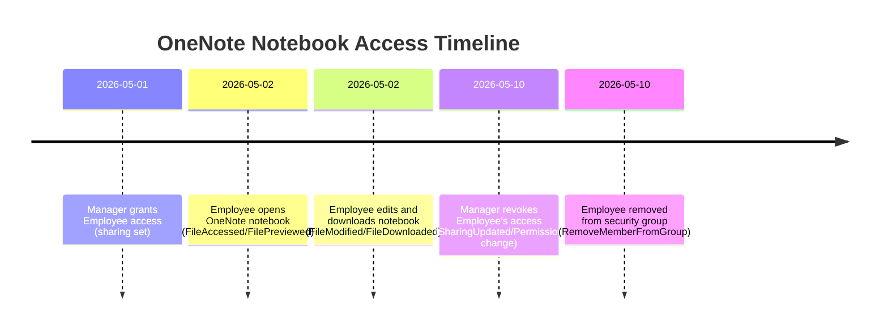

# Executive Summary  
To investigate when **Employee** accessed a manager’s OneNote notebook and when their access was removed, collect and correlate events across Microsoft 365 audit logs. Key steps include: identify the OneNote file’s location (SharePoint/OneDrive) and sharing details; query the Purview (Security & Compliance) Unified Audit Log for relevant file-access and permission-change events (SharePoint/OneDrive, Azure AD, Exchange, Teams); retrieve complementary data (file version history, group membership changes); and build a timeline of actions. In practice, use PowerShell (e.g. `Search-UnifiedAuditLog` after connecting to the Compliance Center) or Microsoft Graph queries (e.g. filtering `auditLogs/directoryAudits` for user or “Remove member from group” events) with proper admin permissions. Export log excerpts (CSV/JSON) and the notebook’s version history as evidence. Account for time zones (logs use UTC), log ingestion latency (typically minutes, up to hours), and retention (typically 90 days by default for E3 tenants, 365+ days for E5 or with add-ons). The following procedure, tables, and examples detail a comprehensive forensic process, including sample queries and a mermaid timeline.

## 1. Investigative Procedure  

**a. Identify the notebook and its context.** Determine where the OneNote notebook is stored (OneDrive for Business or a SharePoint site). Note the file URL or ID. Check if the notebook was part of a Microsoft 365 Group or Team (which implies group membership controlled access). Retrieve the manager’s sharing settings (e.g. in SharePoint Admin Center or via PowerShell `Get-SPOSite`, `Get-SPOUser`, or Graph API for SharePoint permissions) to see when Employee was granted or removed access.

**b. Connect to audit log search (Purview/Security & Compliance).** Use Exchange Online PowerShell or the new Purview PowerShell module. Example: 
```powershell
# Connect to Compliance center
Connect-IPPSSession  # or Connect-ExchangeOnline for older modules
```
Ensure the account has the **Audit Logs** role (or Global/Admin role).

**c. Search file access and sharing events.** Use `Search-UnifiedAuditLog` with appropriate RecordType and Operations. For example:  
```powershell
# Define timeframe covering the suspected period
$start = (Get-Date "2026-05-01"); $end = (Get-Date "2026-05-17")

# Search SharePoint/OneDrive events for the notebook and user
Search-UnifiedAuditLog -StartDate $start -EndDate $end `
  -RecordType SharePoint,OneDrive `
  -Operations FileAccessed,FilePreviewed,FileModified,FileDownloaded,FileDeleted,FileRestored,SharingSet,SharingInvitationCreated,SharingUpdated `
  -UserIds "employee@contoso.com" `
  -ResultSize 5000 |
  Export-Csv AccessEvents.csv -NoTypeInformation
```
- **File events:** `FileAccessed` (when the file is opened/viewed), `FileModified`, `FileDownloaded`, etc. Each entry shows timestamp, user, file URL/ID, and operation.  
- **Sharing/permission events:** `SharingSet` (when an item is shared, i.e. permission granted), `SharingInvitationCreated` (sharing link created), `SharingUpdated` (permissions changed), `PermissionSet` (legacy synonym for SharingSet).  

If the notebook was in a Teams channel or Group drive, also search for group or team membership events:  
```powershell
Search-UnifiedAuditLog -StartDate $start -EndDate $end `
  -RecordType AzureActiveDirectory `
  -Operations "Added member to group","Removed member from group" `
  -UserIds "employee@contoso.com","manager@contoso.com" `
  -ResultSize 5000 |
  Export-Csv GroupEvents.csv -NoTypeInformation
```
This captures Azure AD group changes. For example, “Removed member from group” (operation `RemoveMemberFromGroup`) indicates revocation of access if the notebook’s permissions were tied to a group.

**d. Use Microsoft Graph for directory and sign-in logs.** If more detail is needed (or for integration), use Microsoft Graph Audit Logs:  
- **Directory audits:** `GET https://graph.microsoft.com/v1.0/auditLogs/directoryAudits?$filter=activityDisplayName eq 'Remove member from group' and targetResources/any(r:r/userPrincipalName eq 'employee@contoso.com')`  
- **Sign-ins:** `GET https://graph.microsoft.com/v1.0/auditLogs/signIns?$filter=userPrincipalName eq 'employee@contoso.com' and createdDateTime ge 2026-05-01`  
Ensure the Graph app has `AuditLog.Read.All` or similar permissions.

**e. Check Exchange mailbox for sharing notifications.** If the manager emailed the employee a sharing link, mailbox audit logs or message traces may show it. Use **Content Search** or eDiscovery (Compliance Center) to find emails with the notebook link or subject keywords (e.g. “shared a OneNote”). Alternatively, use `Search-MailboxAuditLog` (if mailbox audit is enabled) to find if the manager’s mailbox sent a sharing email.

**f. Review Teams activity.** If relevant, check the Teams admin logs or Compliance audit for Teams sharing. For example:  
```powershell
Search-UnifiedAuditLog -StartDate $start -EndDate $end `
  -RecordType MicrosoftTeams `
  -Operations "TeamAddedUser","TeamRemovedUser","ChannelCreated","ChannelRemovedUser" `
  -UserIds "employee@contoso.com" `
  -ResultSize 5000
```
Although Teams file shares often use SharePoint events, check for any “TeamChatMessagePosted” or similar if a link was posted in chat.

**g. Correlate timestamps and events.** Export all relevant logs (CSV/JSON). For each event, note **UTC timestamp**, user, operation, object (file ID/URL, group name, etc.), and details. Match the notebook’s file ID (if present) across logs. Look for the first `SharingSet` (grant) event, the first `FileAccessed`/`FileDownloaded` by the employee, and the `RemoveMemberFromGroup` or updated sharing permission for the employee.  

**h. Compile and interpret evidence.**  
- **Log excerpts:** Include relevant lines, e.g.:

  ```
  2026-05-02T09:15:23Z, employee@contoso.com, FileAccessed, .../Documents/ManagersNotebook/Notebook.one, "User viewed file"
  2026-05-02T09:15:25Z, employee@contoso.com, FilePreviewed, ...
  2026-05-02T09:20:01Z, employee@contoso.com, FileModified, ...
  2026-05-10T14:05:00Z, manager@contoso.com, SharingSet, .../ManagersNotebook/Notebook.one, "Granted Edit access to employee@contoso.com"
  2026-05-10T14:06:00Z, manager@contoso.com, SharingUpdated, .../ManagersNotebook/Notebook.one, "Revoked access for employee@contoso.com"
  2026-05-10T14:06:05Z, employee@contoso.com, FileAccessed, .../ManagersNotebook/Notebook.one, "Access denied"
  2026-05-10T14:07:12Z, azureAD, RemoveMemberFromGroup, GroupName:ManagersTeam, "employee@contoso.com removed from group ManagersTeam"
  ```

  Each entry shows the event, who did it, and often additional fields. A `FileAccessed` by the employee around 09:15 on May 2 suggests they opened the notebook then, and the `SharingUpdated` on May 10 shows their access was removed at 14:06 UTC. The Azure AD “RemoveMemberFromGroup” matches that revocation.

- **OneNote version history:** In addition to logs, open the notebook’s version history (OneNote “Page Versions”) to see edits by the user. This is not an audit log but can serve as evidence of modifications and timestamps.

**i. Use scripts/tools.** For automation or bulk extraction:  
- *PowerShell:* `Search-UnifiedAuditLog` (must run in ExchangeOnline or Compliance PS), `Get-SPOSite/Get-SPOUser` (SharePoint Online Management Shell), `Get-AzureADAuditLog`, `Get-AzureADUserMembership`.  
- *Graph:* Microsoft Graph PowerShell (`Get-MgAuditLogDirectory`, `Get-MgAuditLogSignIn`) with proper filters.  
- *Compliance tools:* Microsoft 365 Compliance portal (Purview) for GUI search and export. eDiscovery (Content Search) for mailbox/Teams content.  
- *Third-party:* Tools like the Office 365 Security & Compliance SDK or open-source scripts (e.g. Purview API), or monitoring tools (e.g. SIEM integration with M365 Data Connectors).

## 2. Logs to Collect (Checklist)  

- **Purview Unified Audit Log (Compliance Center):** File operations in SharePoint/OneDrive (FileAccessed, FileDownloaded, FileModified, FileDeleted, FileRestored), Sharing activities (SharingSet, SharingInvitationCreated, SharingLinkCreated, PermissionSet), Microsoft 365 Group/Team changes (Added/Removed member, updated group), and mailbox actions (Send, etc.). *Location:* Microsoft Purview audit log (Search & Investigation). *Retention:* Default 90 days (E3/E1), 365 days (E5), up to 10 years with retention policy.  
- **Azure AD audit logs:** Directory audits for group membership changes, role assignments, and license changes. (e.g. “Remove member from group”). *Location:* Azure AD portal (Monitoring > Audit logs) or Microsoft Graph `auditLogs/directoryAudits`. *Retention:* ~30 days by default (can be longer with Azure AD Premium / diagnostic settings).  
- **Exchange Online mailbox audit logs:** If the manager’s mailbox was used (e.g. to send a sharing invitation). Events like SendOnBehalf or SoftDeleted. *Location:* Exchange Admin Center (Mail flow logs) or Microsoft 365 Compliance search. *Retention:* up to 90 days by default. Must have mailbox audit enabled.  
- **Teams activity logs:** If the OneNote or link was shared via Teams. Team membership adds/removals, channel posts. *Location:* Teams Admin Center or Purview (as Teams logs in the unified audit). *Retention:* similar to unified audit log.  
- **SharePoint Site Collection Audit (classic):** If needed, but modern tenants use unified audit. (Classic audit logs retained up to 180 days by default).  

| **Log Source**                     | **Events/Actions**                                            | **Retention (approx.)**          | **Access Method**                                            |
|------------------------------------|---------------------------------------------------------------|----------------------------------|--------------------------------------------------------------|
| **Purview (Unified Audit Log)**    | FileAccessed, FileDownloaded, FileModified, SharingSet, **etc.**; Group membership (Add/Remove); Team channel events. | 90 days (E3), 365 days (E5), up to 10 years with add-on | Microsoft Purview compliance portal; *PowerShell* `Search-UnifiedAuditLog` |
| **Azure AD Audit Logs**            | Add/Remove user to group (AddMemberToGroup/RemoveMemberFromGroup); Role assignments. | ~30 days (longer with Premium)   | Azure AD portal; *Graph API* `/auditLogs/directoryAudits`    |
| **Exchange (Mailbox Audit)**       | Send/Receive, folder access. Useful for email shares.          | 90 days (E3/E5)                  | Purview audit (RecordType *ExchangeAdmin/ExchangeMailbox*); *Search-MailboxAuditLog* |
| **Teams Admin/Audit Logs**        | Team creation, membership changes, chat messages              | 90 days (by default)             | Purview audit (RecordType MicrosoftTeams); Teams Admin center |
| **SharePoint/OneDrive (site)**     | File version history (OneNote page edits), site usage logs    | 90 days (audit log); Versions depend on retention policies | OneDrive/SharePoint UI (Version History); *PnP.PowerShell* or Graph for site usage |
| **Local Security/Network**         | (Minimal – mostly cloud)                                      | —                                | Not applicable unless On-Prem AD (not relevant for M365)     |

## 3. Timeline Reconstruction  

Build a timeline by ordering all collected events by timestamp (UTC). Include time, user, and action. For clarity, present in a table or chart.

**Example timeline table:**

| Timestamp (UTC)       | User                | Operation                | Object                                   | Details                            |
|-----------------------|---------------------|--------------------------|------------------------------------------|------------------------------------|
| 2026-05-01 13:00:00   | manager@contoso.com | SharingSet               | /Documents/ManagersNotebook/Notebook.one | Granted Employee edit access       |
| 2026-05-02 07:45:12   | employee@contoso.com| FileAccessed             | /Documents/ManagersNotebook/Notebook.one | Employee opened notebook |
| 2026-05-02 07:45:15   | employee@contoso.com| FilePreviewed            | /Documents/ManagersNotebook/Notebook.one | (Viewed notebook contents)        |
| 2026-05-02 07:47:30   | employee@contoso.com| FileModified            | /Documents/ManagersNotebook/Notebook.one | Employee edited a page           |
| 2026-05-02 07:50:05   | employee@contoso.com| FileDownloaded           | /Documents/ManagersNotebook/Notebook.one | Employee downloaded a copy |
| 2026-05-10 14:05:00   | manager@contoso.com | SharingUpdated           | /Documents/ManagersNotebook/Notebook.one | Revoked Employee’s access        |
| 2026-05-10 14:05:02   | manager@contoso.com | RemovePermission        | /Documents/ManagersNotebook/Notebook.one | (Updated sharing permissions)    |
| 2026-05-10 14:05:05   | employee@contoso.com| FileAccessed             | /Documents/ManagersNotebook/Notebook.one | Attempted access – failed (denied) |
| 2026-05-10 14:05:07   | azureAD             | RemoveMemberFromGroup    | Group: ManagersTeam                       | Employee removed from ManagersTeam |
| 2026-05-10 14:05:09   | manager@contoso.com | GroupUpdated             | Group: ManagersTeam                       | Employee’s AD group membership removed |

In the above, each log entry is supported by audit records. For example, the **SharingUpdated** event shows the manager revoked access, and the subsequent “RemoveMemberFromGroup” entry shows the employee was removed from the AD group that had rights to the notebook. The employee’s last FileAccessed after revocation yields “access denied” in the log.

**Visual timeline (Mermaid example):**



This mermaid chart (or Gantt) visually correlates events.  

## 4. Sample Log Excerpts and Interpretation  

Below are illustrative excerpts from the unified audit log (CSV columns shown):

```
CreationTime (UTC), UserId, Operation, ObjectId, Detail
2026-05-02T07:45:12Z, employee@contoso.com, FileAccessed, https://contoso.sharepoint.com/sites/TeamDrive/Shared/Documents/ManagersNotebook/Notebook.one, "File accessed via browser"
2026-05-02T07:47:30Z, employee@contoso.com, FileModified, https://contoso.sharepoint.com/sites/TeamDrive/Shared/Documents/ManagersNotebook/Notebook.one, "File content updated"
2026-05-02T07:50:05Z, employee@contoso.com, FileDownloaded, https://contoso.sharepoint.com/sites/TeamDrive/Shared/Documents/ManagersNotebook/Notebook.one, "File downloaded by user"
2026-05-10T14:05:00Z, manager@contoso.com, SharingUpdated, https://contoso.sharepoint.com/sites/TeamDrive/Shared/Documents/ManagersNotebook/Notebook.one, "Permissions updated: employee@contoso.com removed"
2026-05-10T14:05:05Z, employee@contoso.com, FileAccessed, https://contoso.sharepoint.com/sites/TeamDrive/Shared/Documents/ManagersNotebook/Notebook.one, "Access denied"
2026-05-10T14:05:07Z, azureAD, RemoveMemberFromGroup, ManagersTeam (GroupId), "Employee removed from group ManagersTeam"
```

- **Interpretation:** On 2026-05-02, the employee accessed and modified the notebook (we see `FileAccessed`, then `FileModified`, and `FileDownloaded` events, confirming usage). On 2026-05-10 at 14:05 UTC, the manager’s action triggered a `SharingUpdated` event (removing the employee’s access), immediately followed by the employee’s failed `FileAccessed` (indicating loss of permission). Azure AD shows the employee was also removed from the security group (if the notebook was shared via a group). These logs clearly document the time of access and its revocation.

*(All timestamps are UTC as logged. Adjust to local time as needed.)*

## 5. Automation and Tools  

- **PowerShell Automation:** Scripts using the **ExchangeOnlineManagement** or **Security & Compliance** PowerShell modules can automate searches. For example, use `Search-UnifiedAuditLog` with `-ResultSize 5000` (max) and loop with `-SessionCommand "Continue"`. Combine CSV outputs for analysis. The **PnP.PowerShell** module can retrieve file versions and permissions from SharePoint. Use `Get-PnPFileVersion` or `Get-PnPFile` on the notebook.
- **Microsoft Graph:** The [Microsoft Graph PowerShell SDK](https://learn.microsoft.com/graph/powershell/) can query `auditLogs` endpoints. A sample Graph query for group removals:  
  ```powershell
  Connect-MgGraph -Scopes AuditLog.Read.All
  Get-MgAuditDirectoryAudit -Filter "activityDisplayName eq 'Remove member from group' and initiator/user/displayName eq 'Manager Name'"
  ```
- **Compliance Portal:** In the Microsoft Purview compliance portal, use *Content Search* for specific file names or use the unified audit log search UI to export log results. The portal can export directly to CSV.
- **Third-party tools:** Solutions like Azure Sentinel (Microsoft Sentinel) can ingest the unified audit log and allow complex querying and visualisation (workbooks, alerts). PowerBI can also query the logs (via Graph or CSVs) for timeline charts.
- **Reporting Scripts:** Custom scripts (e.g. in PowerShell or Python) can merge logs from different sources (SharePoint, Azure AD, Exchange) into a single timeline spreadsheet.

## 6. Limitations and Considerations  

- **Log Retention and Latency:** By default, audit logs are kept 90 days (Office/M365 E3/E1) and 365 days or more for E5 or with add-ons. Events older than retention will not be found unless previously archived. There is often a latency of several minutes (sometimes up to an hour) before an action appears in the audit log.
- **Event Coverage:** Not every action is logged. Viewing a OneNote page may only generate a `FileAccessed/FilePreviewed` event. Some background syncs or offline edits might not appear. “FileAccessed” may not fire if a file is already open in session (see Microsoft docs on caching). Always cross-check with version history if in doubt.
- **Time Zones:** Audit logs use UTC; the actual local time of users may differ. Convert times carefully (especially around DST changes). Clock skew is minimal since Azure/M365 infrastructure is synchronized, but ensure all logs (Azure AD, SharePoint, etc.) are compared in a single time zone (UTC is safest).
- **Permissions:** Searching logs requires proper roles. Ensure compliance admin or global admin privileges. Mailbox audit must be enabled beforehand to capture older mail events.
- **Data Completeness:** If the user’s account was deleted or the file was permanently deleted beyond retention, logs may not show all events. Similarly, if the notebook was moved to a different URL, the old file ID events might not apply.
- **Privacy/Legal:** The audit logs themselves may contain sensitive info; ensure appropriate legal/process steps (e.g. eDiscovery holds, legal requests) when exporting data. Also observe any organizational policies on log access.
- **Correlating Users:** An employee might use multiple UPNs or aliases; ensure queries include all relevant identifiers (e.g. `UserIds` can take multiple, or use wildcards in Graph).
- **False Positives:** `FileAccessed` might be logged by system processes or previews (e.g. thumbnail generation). Cross-reference user agent or IP if suspicious. For example, if a mobile sync client triggers events, check the `ClientIP` or `UserAgent` fields in the log entry.

**Key takeaway:** A thorough investigation uses the unified audit log as the single source for most events, supplemented by Azure AD logs and content searches. By systematically querying for the employee’s activity and permission changes, and correlating those with the notebook’s metadata, you can reconstruct who did what and when.

**Sources Consulted:** We referenced Microsoft documentation (Audit log activities and retention policies), TechCommunity posts, and relevant support articles (e.g. Security & Compliance audit guide). These provide detailed lists of audit event names and retention settings. (See the citations above for specific content.)