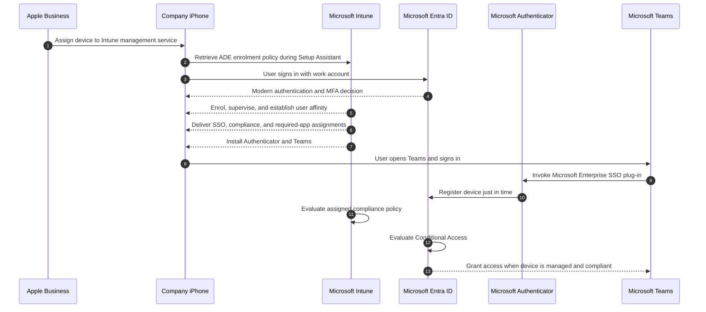

# Modern iOS Intune Enrolment

## Administrator Configuration and Compliance Runbook

**Deployment model:** Company-owned iPhone, Apple Automated Device Enrolment, user affinity, Setup Assistant with modern authentication, and just-in-time registration through Microsoft Teams

---

## Document control

| Field | Value |
| --- | --- |
| Document owner | Endpoint Management |
| Control owners | Endpoint Management; Identity and Access Management |
| Approver | Information Security |
| Classification | Internal |
| Version | 1.0 |
| Effective date | 30 July 2026 |
| Review cycle | At least annually and after any material Intune, Apple, Entra ID, authentication, or Conditional Access change |
| Scope | New or factory-reset, company-owned iPhones |
| Out of scope | Personally owned devices, iPad, shared devices, Apple Configurator enrolment, and previously enrolled devices |

## Purpose

This runbook defines the approved configuration, deployment, validation, and evidence requirements for enrolling company-owned iPhones into Microsoft Intune.

The control design provides:

- automated and supervised enrolment from Apple Business;
- non-removable Intune management;
- user-to-device affinity established in Setup Assistant;
- modern authentication during enrolment;
- Microsoft Entra device registration through just-in-time registration;
- Microsoft Teams as the first work application;
- Microsoft Authenticator as the Microsoft Enterprise SSO plug-in provider;
- device compliance assessment before access to protected resources;
- Conditional Access enforcement; and
- auditable evidence for each production deployment.

## Approved architecture

## Control principles

1. Only company-owned iPhones assigned to the Intune device management service in Apple Business may use this enrolment route.
2. The iPhone must be new or erased before enrolment.
3. The enrolment policy must use **Enroll with User Affinity** and **Setup Assistant with modern authentication**.
4. **Locked enrollment** must be enabled.
5. Microsoft Authenticator and Microsoft Teams must be installed as required, device-licensed Apps and Books applications.
6. The user must open and sign in to Teams before opening any other work application.
7. The Microsoft Enterprise SSO plug-in must complete Microsoft Entra registration and initiate the compliance check.
8. A device must be both managed and compliant before Conditional Access grants access to protected resources.
9. Company Portal is not used to complete Microsoft Entra registration or compliance. Intune may still install it as a required diagnostic application; users do not need to open or sign in to it for this workflow.
10. Production Conditional Access enforcement must not begin until pilot evidence has been approved.

## Standard object names

Use the following names unless an approved organisation-wide naming standard takes precedence.

| Object | Standard name |
| --- | --- |
| ADE device group | `SG-INTUNE-IOS-CORP-ADE` |
| Pilot user group | `SG-INTUNE-IOS-ADE-JIT-PILOT` |
| Production user group | `SG-INTUNE-IOS-ADE-JIT-USERS` |
| Emergency-access exclusion group | `SG-CA-EMERGENCY-ACCESS-EXCLUDE` |
| Apple enrolment policy | `ENR-IOS-CORP-ADE-JIT` |
| JIT SSO configuration profile | `CFG-IOS-CORP-JIT-SSO` |
| Compliance policy | `CMP-IOS-CORP-L2` |
| Noncompliance notification | `NTF-IOS-NONCOMPLIANCE` |
| Enrollment MFA policy | `CA-INTUNE-ENROLLMENT-Require-MFA` |
| Compliant-device access policy | `CA-IOS-Require-Compliant-Device` |
| DDM software-update profile | `UPD-IOS-CORP-DDM` |

## Mandatory implementation record

Complete this table before production approval.

| Controlled value | Recorded value |
| --- | --- |
| Organisation name | |
| Primary tenant domain | |
| Apple Business organisation ID | |
| Apple Business location | |
| Apple management service name | |
| Managed Apple Account used for the ADE token | |
| Apple Account used for the APNs certificate | |
| APNs certificate UID | |
| Apps and Books token location | |
| Service desk name | |
| Service desk telephone number | |
| Service desk support URL | |
| Security approver | |
| Production change record | |

## Roles and licensing

### Administrative roles

| Activity | Minimum operating role |
| --- | --- |
| Assign iPhones to a device management service in Apple Business | Apple Business role with device-management assignment permission, normally Device Enrolment Manager |
| Acquire Apps and Books licences | Apple Business Content Manager or equivalent delegated permission |
| Configure Intune enrolment, apps, profiles, and compliance | Intune Administrator or a custom Intune role containing only the required enrolment, mobile-app, device-configuration, and compliance permissions |
| Configure Conditional Access | Conditional Access Administrator |
| Review sign-in and audit evidence | Security Reader plus the required Intune read permissions |

Privileged roles must be activated only for the duration of the change when Privileged Identity Management is available.

### Licensing

Each enrolling user must have:

- Microsoft Intune Plan 1 or a suite that includes it;
- Microsoft Entra ID P1 or later when Conditional Access is enforced;
- a Microsoft Teams service entitlement; and
- any licence required by an assigned mobile threat defence or Microsoft Defender for Endpoint control.

## Prerequisite gate

Do not distribute an iPhone until every applicable item passes.

| Check | Required result |
| --- | --- |
| Intune is the tenant MDM authority | Pass |
| Apple MDM push certificate is active | Pass |
| Apple ADE enrolment token is active | Pass |
| Apps and Books token is active and synchronised | Pass |
| iPhone serial number exists in Apple Business | Pass |
| iPhone is assigned to the Intune management service | Pass |
| iPhone appears under the corresponding Intune enrolment token | Pass |
| `ENR-IOS-CORP-ADE-JIT` is assigned to the iPhone | Pass |
| User is licensed for Intune, Entra ID, and Teams | Pass |
| User belongs to the appropriate pilot or production user group | Pass |
| Authenticator has an available device licence | Pass |
| Teams has an available device licence | Pass |
| Company Portal has an available device licence when the enrolment policy deploys it through Apps and Books | Pass |
| JIT SSO profile is assigned | Pass |
| Compliance policy is assigned | Pass |
| Required Intune and Apple endpoints are reachable without unsupported TLS inspection | Pass |
| User has an enrolment-compatible MFA method or Temporary Access Pass when MFA is required | Pass |
| Emergency-access accounts are excluded from Conditional Access | Pass |

## 1. Establish Apple management trust

### 1.1 Create or verify the Apple MDM push certificate

In the Microsoft Intune admin centre:

1. Go to **Devices** > **Device onboarding** > **Enrollment**.
2. Select the **Apple** tab.
3. Select **Apple MDM Push Certificate**.
4. Grant Microsoft permission to send device information to Apple.
5. Download the certificate signing request.
6. Open the Apple Push Certificates Portal.
7. Sign in with an organisation-controlled Apple Account.
8. Create the push certificate from the Intune certificate signing request.
9. Download the Apple certificate.
10. Return to Intune, record the Apple Account, and upload the certificate.
11. Confirm that the certificate state is **Active**.
12. Record the certificate UID and expiry date in the implementation evidence.

The same Apple Account and the same certificate record must be used for annual renewal. Creating a replacement certificate instead of renewing the existing certificate breaks management for devices enrolled with the original certificate and requires re-enrolment.

### 1.2 Create the Apple ADE enrolment token

Keep the Intune browser tab open for the entire token-creation process.

In the Microsoft Intune admin centre:

1. Go to **Devices** > **Device onboarding** > **Enrollment**.
2. Select **Apple mobile**.
3. Under **Bulk Enrollment Methods**, select **Enrollment program tokens**.
4. Select **Add**.
5. Accept the data-sharing notice.
6. Download the Intune public-key certificate in `.pem` format.

In Apple Business:

1. Sign in with an organisation-controlled Managed Apple Account.
2. Go to the organisation preferences for device management services.
3. Add an external device management service.
4. Enter the approved management service name.
5. Upload the `.pem` certificate downloaded from Intune.
6. Download the server token in `.p7m` format.
7. Go to **Devices** > **Inventory**.
8. Select the required iPhone serial numbers.
9. Select **Assign Device Management**.
10. Choose the Intune management service and confirm.
11. Set the Intune management service as the default assignment for newly added iPhones when all corporate iPhones use this service.

Back in the Microsoft Intune admin centre:

1. Enter the Managed Apple Account used to create the token.
2. Upload the `.p7m` server token.
3. Create the token.
4. Open the token and select **Devices** > **Sync**.
5. Confirm that the assigned iPhone serial numbers appear.
6. Record the token identifier, account, last successful sync, and expiry date.

### 1.3 Configure the Apps and Books token

In Apple Business:

1. Acquire sufficient licences for:
   - Microsoft Authenticator;
   - Microsoft Teams; and
   - Intune Company Portal when Intune deploys it for diagnostics.
2. Keep a licence reserve above the number of assigned iPhones.
3. Go to the organisation preferences for **Payments and Billing** > **Apps and Books**.
4. Download the content token for the approved Apple Business location.

In the Microsoft Intune admin centre:

1. Go to **Tenant administration** > **Connectors and tokens** > **Apple VPP tokens**.
2. Select **Create**.
3. Set **Token Name** to the approved Apple Business location name.
4. Enter the Managed Apple Account associated with the token.
5. Upload the content token.
6. Set **Take control of token from another MDM** to **No** unless an approved migration is in progress.
7. Set the correct App Store **Country/Region**.
8. Set **Type of VPP account** to **Business**.
9. Set **Automatic app updates** to **Yes**.
10. Accept the data-sharing statement.
11. Create the token and select **Sync**.
12. Confirm that Authenticator and Teams appear in **Apps** > **All Apps** with the correct VPP token name.

## 2. Create deployment groups

In the Microsoft Entra admin centre, create:

### `SG-INTUNE-IOS-CORP-ADE`

- Group type: **Security**
- Membership type: **Assigned**
- Purpose: enrollment-time grouping and device-targeted application and policy delivery

### `SG-INTUNE-IOS-ADE-JIT-PILOT`

- Group type: **Security**
- Membership type: **Assigned**
- Purpose: named pilot users only

### `SG-INTUNE-IOS-ADE-JIT-USERS`

- Group type: **Security**
- Membership type: **Assigned**
- Purpose: approved production users

### `SG-CA-EMERGENCY-ACCESS-EXCLUDE`

- Group type: **Security**
- Membership type: **Assigned**
- Purpose: emergency-access accounts excluded from Conditional Access

Emergency-access accounts must not be used for ordinary enrolment testing.

## 3. Create the Apple enrolment policy

In the Microsoft Intune admin centre:

1. Go to **Devices** > **Device onboarding** > **Enrollment**.
2. Select **Apple mobile**.
3. Select **Enrollment program tokens**.
4. Open the required token.
5. Select **Enrollment policies**.
6. Select **Create policy** > **iOS/iPadOS**.

### 3.1 Basics

| Setting | Value |
| --- | --- |
| Name | `ENR-IOS-CORP-ADE-JIT` |
| Description | Company-owned iPhone ADE enrolment with user affinity, Setup Assistant modern authentication, and Teams-triggered JIT registration |

### 3.2 Device group

Select the static security group:

`SG-INTUNE-IOS-CORP-ADE`

This enrollment-time group is the assignment target for device configuration, compliance, Authenticator, and Teams.

### 3.3 Configuration settings

| Setting | Required value |
| --- | --- |
| User Affinity | **Enroll with User Affinity** |
| Authentication method | **Setup Assistant with modern authentication** |
| Locked enrollment | **Yes** |
| Shared iPad | **No** |
| Sync with computers | **Deny All**, unless an approved support requirement uses Apple Configurator by certificate |
| Await final configuration | **Yes** |
| Apply device name template | **Yes** |
| Device name template | `CORP-{{DEVICETYPE}}-{{SERIAL}}` |
| Department | Endpoint Management or the approved service desk name |
| Department Phone | Approved service desk telephone number |

If **Install Company Portal with VPP** is displayed for the selected authentication method, select the approved Apps and Books token. Company Portal is not used for registration or compliance in this design, but device licensing prevents an Apple Account prompt if Intune deploys the application for diagnostics.

Only device configuration policies are processed during **Await final configuration**. Required applications can continue to install after the home screen appears.

The **Deny All** computer-synchronisation choice is applied at activation and cannot be relaxed without erasing and re-enrolling the iPhone. Confirm that no approved support or recovery process requires computer pairing before assigning the policy.

### 3.4 Setup Assistant screens

Use this baseline for a new corporate iPhone.

| Setup Assistant screen | Value |
| --- | --- |
| Passcode | **Hide** |
| Location Services | **Show** |
| Restore | **Hide** |
| Apple ID | **Hide** |
| Terms and conditions | **Show** |
| Touch ID and Face ID | **Hide** |
| Apple Pay | **Hide** |
| Zoom | **Hide** |
| Siri | **Hide** |
| Display Tone | **Hide** |
| Diagnostics Data | **Hide** |
| Privacy | **Show** |
| Android Migration | **Hide** |
| iMessage and FaceTime | **Hide** |
| Onboarding | **Hide** |
| Screen Time | **Hide** |
| SIM Setup | **Show** |
| Software Update | **Show** |
| Watch Migration | **Hide** |
| Appearance | **Hide** |
| Device to Device Migration | **Hide** |
| Restore Completed | **Hide** |
| Software Update Completed | **Show** |
| Get Started | **Show** |
| Terms of Address | **Hide** |
| Emergency SOS | **Show** |
| Action button | **Hide** |
| Intelligence | **Hide** |
| Camera button | **Hide** |
| Web content filtering | **Hide** |
| App Store | **Hide** |
| Safety and handling | **Show** |
| OS Showcase | **Hide** |

Hiding a Setup Assistant screen streamlines initial setup; it does not permanently restrict the corresponding feature. Permanent restrictions belong in an approved device-configuration security baseline.

The Passcode and Touch ID or Face ID panes must remain hidden because they do not operate correctly in this enrolment workflow on current iOS versions. The compliance policy prompts the user to create a compliant passcode after enrolment.

### 3.5 Assign the policy

1. Create the policy.
2. Open the enrolment token.
3. Select **Devices**.
4. Select each pilot iPhone.
5. Select **Assign policy**.
6. Select `ENR-IOS-CORP-ADE-JIT`.
7. Confirm the assignment before the iPhone is activated.

Set this policy as the default for the token only when every iPhone synchronised through that token must use this configuration.

Changes to most enrolment-policy settings apply only after an assigned iPhone is erased and re-enrolled.

## 4. Configure just-in-time registration and SSO

In the Microsoft Intune admin centre:

1. Go to **Devices** > **Manage devices** > **Configuration**.
2. Select **Create** > **New policy**.
3. Set **Platform** to **iOS/iPadOS**.
4. Set **Profile type** to **Templates** > **Device features**.
5. Create the profile.

### 4.1 Basics

| Setting | Value |
| --- | --- |
| Name | `CFG-IOS-CORP-JIT-SSO` |
| Description | Microsoft Enterprise SSO plug-in configuration for Teams-triggered JIT registration |

### 4.2 Single sign-on app extension

| Setting | Required value |
| --- | --- |
| SSO app extension type | **Microsoft Entra ID** |
| Enable shared device mode | **Not configured** |
| App bundle IDs | Leave empty unless an approved non-Microsoft application requires SSO |

Do not add bundle IDs for Teams, Authenticator, Edge, Outlook, or any other Microsoft application. Microsoft applications are covered automatically.

### 4.3 Additional configuration

Add exactly these entries. Keys and values must not contain leading or trailing spaces.

| Key | Type | Value | Status |
| --- | --- | --- | --- |
| `device_registration` | String | `{{DEVICEREGISTRATION}}` | Required |
| `browser_sso_interaction_enabled` | Integer | `1` | Required by this baseline |

Do not add the Microsoft Authenticator bundle ID.

### 4.4 Assignment

Assign the profile to:

`SG-INTUNE-IOS-CORP-ADE`

Do not use a broad assignment until the pilot acceptance criteria pass.

## 5. Deploy Microsoft Authenticator and Teams

Both applications must come from the Apple Business Apps and Books synchronisation so that Intune can use device licensing and silent installation.

For each application in **Apps** > **All Apps**:

1. Open the VPP application.
2. Select **Properties**.
3. Edit **Assignments**.
4. Under **Required**, add `SG-INTUNE-IOS-CORP-ADE`.
5. Set **License type** to **Device**.
6. Save the assignment.

### Required application state

| Application | Intent | Licence type | Assignment | Purpose |
| --- | --- | --- | --- | --- |
| Microsoft Authenticator | Required | Device | `SG-INTUNE-IOS-CORP-ADE` | Hosts the Microsoft Enterprise SSO plug-in and brokers JIT registration |
| Microsoft Teams | Required | Device | `SG-INTUNE-IOS-CORP-ADE` | Approved first work application and JIT registration trigger |

Microsoft Defender for Endpoint must not be the first application opened after enrolment when it is deployed. Teams remains the designated first application.

## 6. Configure tenant-wide compliance behaviour

Tenant-wide compliance settings affect every managed platform. Process changes through the organisation's normal change control.

In the Microsoft Intune admin centre:

1. Go to **Endpoint security** > **Device compliance** > **Compliance policy settings**.
2. Configure:

| Setting | Baseline value |
| --- | --- |
| Mark devices with no compliance policy assigned as | **Not compliant** |
| Compliance status validity period | **30 days** |

The validity period may be shortened only after impact assessment across every Intune-managed platform.

## 7. Create the iPhone compliance policy

In the Microsoft Intune admin centre:

1. Go to **Devices** > **Manage devices** > **Compliance**.
2. Select **Policies** > **Create policy**.
3. Set **Platform** to **iOS/iPadOS**.
4. Select **Create**.

### 7.1 Basics

| Setting | Value |
| --- | --- |
| Name | `CMP-IOS-CORP-L2` |
| Description | Enhanced-security compliance baseline for company-owned ADE iPhones |

### 7.2 Compliance settings

The following is the approved Level 2 baseline.

| Category | Setting | Value |
| --- | --- | --- |
| Email | Unable to set up email on the device | **Not configured** |
| Device Health | Jailbroken devices | **Block** |
| Device Health | Require the device to be at or under the Device Threat Level | **Not configured**, unless an approved mobile threat defence integration exists |
| Device Properties | Minimum OS version | `18.0` |
| Device Properties | Maximum OS version | **Not configured** |
| Device Properties | Minimum OS build version | **Not configured** |
| Device Properties | Maximum OS build version | **Not configured** |
| Microsoft Defender for Endpoint | Require the device to be at or under the machine risk score | **Not configured**, unless Microsoft Defender for Endpoint is integrated |
| System Security | Require a password to unlock mobile devices | **Require** |
| System Security | Simple passwords | **Block** |
| System Security | Minimum password length | `6` |
| System Security | Required password type | **Numeric** |
| System Security | Number of non-alphanumeric characters in password | **Not configured** |
| System Security | Maximum minutes after screen lock before password is required | `5 minutes` |
| System Security | Maximum minutes of inactivity until screen locks | `5 minutes` |
| System Security | Password expiration (days) | **Not configured** |
| System Security | Number of previous passwords to prevent reuse | **Not configured** |
| Device Security | Restricted apps | **Not configured** |

The minimum OS value must be reviewed after each Apple major release, each material Microsoft Teams support change, and each security baseline review. Raising it requires a compatibility pilot and a user-remediation window.

### 7.3 Actions for noncompliance

| Action | Schedule |
| --- | --- |
| Mark device noncompliant | Immediately |
| Send email to end user using `NTF-IOS-NONCOMPLIANCE` | After 1 day |

Do not configure an automatic retire or wipe action in this policy. Unresolved noncompliance must create a service-management incident and follow the approved device-handling process.

### 7.4 Assignment

Assign the policy to:

`SG-INTUNE-IOS-CORP-ADE`

Verify assignment before enabling Conditional Access enforcement.

## 8. Configure Conditional Access

Conditional Access must be deployed in a separate pilot ring and reviewed in report-only mode.

### 8.1 Enrollment MFA policy

This policy protects the enrolment authentication event. It does not enforce device compliance; compliance is enforced after JIT registration by the resource-access policy.

In the Microsoft Entra admin centre:

1. Go to **Entra ID** > **Conditional Access** > **Policies**.
2. Select **New policy**.
3. Configure:

| Control | Value |
| --- | --- |
| Name | `CA-INTUNE-ENROLLMENT-Require-MFA` |
| Include users | `SG-INTUNE-IOS-ADE-JIT-PILOT` during pilot; production group after approval |
| Exclude users | `SG-CA-EMERGENCY-ACCESS-EXCLUDE` |
| Target resource | **Microsoft Intune Enrollment** |
| Conditions | None |
| Grant | **Grant access** and **Require multifactor authentication** |
| Session controls | Not configured |
| Initial state | **Report-only** |

Do not add a device filter, compliant-device grant, or application-protection grant to the enrolment-specific policy.

Setup Assistant does not support phishing-resistant MFA. When the user's registered authentication method is unavailable on the new iPhone, provide an approved Temporary Access Pass or require a second device for the MFA challenge.

If **Microsoft Intune Enrollment** is not available as a target resource, the tenant's Entra administrator must create the Microsoft service principal with application ID:

`d4ebce55-015a-49b5-a083-c84d1797ae8c`

### 8.2 Compliant-device access policy

Create a separate policy:

| Control | Value |
| --- | --- |
| Name | `CA-IOS-Require-Compliant-Device` |
| Include users | `SG-INTUNE-IOS-ADE-JIT-PILOT` during pilot; production group after approval |
| Exclude users | `SG-CA-EMERGENCY-ACCESS-EXCLUDE` |
| Target resources | **All resources** |
| Device platforms | **iOS** |
| Grant | **Grant access** and **Require device to be marked as compliant** |
| Session controls | Not configured |
| Initial state | **Report-only** |

Before changing the policy to **On**:

1. Confirm that at least one pilot iPhone is compliant.
2. Review report-only results for the pilot user.
3. Confirm successful Teams JIT registration.
4. Confirm that no required application or enrolment resource is unexpectedly blocked.
5. Record Security approval.

### 8.3 Application-protection policy interaction

If the tenant separately requires an Intune app protection policy:

1. Assign a compatible iOS app protection policy to the same users before enabling its Conditional Access grant.
2. Confirm Teams is included in the protected-app list.
3. Keep application-protection enforcement in a separate Conditional Access policy.
4. Validate the combined result in report-only mode.

Do not create new policies using **Require approved client app**. That grant became read-only on 30 June 2026. Existing policies that contain it can continue to enforce access and must be included in the pre-production Conditional Access review.

## 9. Manage iOS software updates

Use Apple declarative device management rather than legacy MDM software-update policies.

In the Microsoft Intune admin centre:

1. Go to **Devices** > **Manage devices** > **Configuration**.
2. Select **Create** > **New policy**.
3. Set **Platform** to **iOS/iPadOS**.
4. Set **Profile type** to **Settings catalog**.
5. Name the profile `UPD-IOS-CORP-DDM`.
6. Add settings from **Declarative Device Management** > **Software Update**.
7. For each approved release, record:
   - Target OS Version;
   - Target Build Version, when required;
   - Target Date Time; and
   - the organisation's update-information URL.
8. Assign the profile to the approved deployment ring.
9. Promote the update from pilot to production only after compatibility acceptance.

The target version and build are change-controlled operational values and must not be left pointing to a superseded release.

## 10. Provision a new iPhone

### 10.1 Administrator pre-flight

1. Match the physical iPhone serial number to Apple Business.
2. Confirm the serial is assigned to the Intune management service.
3. Sync the Intune enrolment token.
4. Confirm `ENR-IOS-CORP-ADE-JIT` is assigned.
5. Confirm the user is in the correct pilot or production group.
6. Confirm the user holds all required licences.
7. Confirm Authenticator and Teams have available device licences.
8. Confirm the JIT SSO profile and compliance policy target `SG-INTUNE-IOS-CORP-ADE`.
9. Confirm the iPhone is new or erased and at the Hello screen.
10. Record the serial number, asset identifier, assigned user, and change or request number.

### 10.2 Expected user sequence

1. Turn on the iPhone.
2. Select language and region.
3. Connect to a trusted Wi-Fi or mobile network.
4. Continue through the **Remote Management** screen.
5. Sign in with the organisation's Microsoft Entra account when prompted.
6. Complete MFA using the approved method when prompted.
7. Wait while Intune enrols and configures the iPhone.
8. Complete the allowed Setup Assistant panes.
9. At the home screen, wait for Microsoft Authenticator and Microsoft Teams to install.
10. Do not open Outlook, Edge, Defender, or another work application first.
11. Open Microsoft Teams.
12. Sign in with the same Microsoft Entra account.
13. Complete the JIT registration prompt.
14. If prompted to create or strengthen the iPhone passcode, complete the remediation.
15. Wait for the compliance check to finish.
16. Confirm Teams opens and organisational content is available.

The Setup Assistant sign-in establishes enrolment and user affinity. The Teams sign-in performs Microsoft Entra registration and the compliance check. Both sign-ins are expected.

## 11. Acceptance tests

Run every test on a factory-reset pilot iPhone.

| ID | Test | Expected result | Evidence |
| --- | --- | --- | --- |
| ADE-01 | Activate the assigned iPhone | Remote Management appears and cannot be skipped | Photograph or controlled screenshot |
| ADE-02 | Sign in during Setup Assistant | Modern Microsoft sign-in succeeds and user affinity is established | Intune enrolment record |
| ADE-03 | Inspect device ownership | Ownership is **Corporate** and supervision is **Yes** | Intune device properties export |
| ADE-04 | Inspect management profile | User cannot remove Intune management | Device properties or controlled screenshot |
| CFG-01 | Complete Await final configuration | Device configuration finishes before the home screen is released | Enrolment timestamp and profile status |
| APP-01 | Check Authenticator deployment | Authenticator installs as a managed application | Managed app status |
| APP-02 | Check Teams deployment | Teams installs as a managed application | Managed app status |
| JIT-01 | Open Teams first and sign in | JIT flow starts without Company Portal interaction | Screen recording or test notes |
| JIT-02 | Complete registration | Entra device record is created and its device ID matches the **Microsoft Entra device ID** field in Intune | Entra and Intune exports |
| CMP-01 | Meet passcode and OS requirements | Intune reports **Compliant** | Compliance policy report |
| CMP-02 | Review per-setting status | Every configured setting reports compliant | Per-setting compliance report |
| CA-01 | Review Teams sign-in | `Is managed` is **Yes**, `Is compliant` is **Yes**, and device ID is present | Entra sign-in log |
| CA-02 | Review Conditional Access | Required policies report **Success** | Conditional Access tab export |
| SSO-01 | Open a second Microsoft application | SSO reduces or removes the additional credential prompt | Test record |
| NEG-01 | Test a noncompliant pilot condition | Protected access is denied or remediated as designed | Sign-in log and remediation record |
| NEG-02 | Remove pilot user from scope | Production users remain unaffected | Group and policy assignment record |

## 12. Required production evidence

Retain the following with the production change record.

### Apple evidence

- iPhone serial assigned to the approved Intune management service;
- management service identifier;
- ADE token status and expiry;
- Apps and Books token status and expiry;
- available and assigned licence counts for Authenticator and Teams.

### Intune evidence

- enrolment-policy settings and assignment;
- device name, serial number, asset identifier, and primary user;
- ownership **Corporate**;
- supervised **Yes**;
- enrollment profile or policy `ENR-IOS-CORP-ADE-JIT`;
- JIT SSO profile deployment **Succeeded**;
- Authenticator and Teams managed-app deployment **Installed**;
- compliance policy `CMP-IOS-CORP-L2`;
- overall compliance **Compliant**;
- per-setting compliance results;
- last check-in time and iOS version.

### Entra ID evidence

- Entra device ID matching the **Microsoft Entra device ID** field in Intune;
- join or registration state;
- managed **Yes**;
- compliant **Yes**;
- assigned user;
- successful Teams sign-in;
- Conditional Access policy results;
- authentication requirement and method used during enrolment.

### Change evidence

- pilot test record;
- Security approval;
- production change approval;
- implementation date and administrator;
- exceptions or deviations;
- post-implementation review result.

## 13. Operational monitoring

### Daily during rollout

- failed iOS enrolments;
- devices in **Not evaluated**, **In grace period**, or **Not compliant**;
- Authenticator and Teams installation failures;
- Conditional Access failures for pilot or newly enrolled users;
- Apple token sync failures;
- Apps and Books licence exhaustion.

### Monthly

- iPhone OS-version distribution;
- inactive devices approaching the compliance validity period;
- noncompliance reasons and ageing;
- required-application version and installation status;
- Conditional Access failures by policy;
- Apple certificate and token expiry dates.

### Quarterly

- review all assignments and exclusions;
- confirm emergency-access accounts remain valid and monitored;
- test one complete factory-reset enrolment;
- review minimum iOS version;
- review Teams and Authenticator support requirements;
- verify current Apple and Microsoft network endpoint requirements;
- review existing Conditional Access policies for conflicting grants;
- confirm that no new workflow depends on Company Portal sign-in.

## 14. Certificate and token lifecycle

| Credential | Validity | Renewal control |
| --- | --- | --- |
| Apple MDM push certificate | 365 days | Renew the existing certificate with the same Apple Account; begin at least 30 days before expiry |
| Apple ADE enrolment token | Renew annually | Renew before expiry and confirm a successful device sync |
| Apple Apps and Books token | 365 days | Renew the same location token and confirm application and licence synchronisation |

Create monitored reminders at 60, 30, 14, and 7 days before expiry. Store the responsible account, credential owner, renewal evidence, and recovery contact in the approved privileged-access record.

Never delete and recreate an Apple token or certificate as a routine renewal action.

## 15. Troubleshooting

### Remote Management does not appear

1. Confirm the serial number exists in Apple Business.
2. Confirm it is assigned to the correct Intune management service.
3. Confirm the Intune ADE token last synchronised successfully.
4. Confirm an enrolment policy is assigned to the serial.
5. Confirm the iPhone was erased after the assignment.
6. Test on a network that can reach Apple activation and Intune endpoints.

### Invalid Profile

1. Go to Intune enrollment restrictions.
2. Confirm iOS/iPadOS is allowed for the enrolling user.
3. Block personally owned iOS/iPadOS devices rather than blocking the platform.
4. Confirm the ADE token and APNs certificate are active.
5. Re-sync the Apple token.

### Authenticator or Teams does not install

1. Confirm the iPhone joined `SG-INTUNE-IOS-CORP-ADE`.
2. Confirm each application has a **Required** device-licensed assignment.
3. Confirm the Apps and Books token is active and synchronised.
4. Confirm sufficient licences exist.
5. Confirm the device is online, unlocked, and checking in.
6. Review the managed-app installation report.

### Teams sign-in does not start JIT registration

1. Confirm Authenticator is installed.
2. Confirm `CFG-IOS-CORP-JIT-SSO` reports **Succeeded**.
3. Confirm the exact JIT key:
   - `device_registration`
   - String
   - `{{DEVICEREGISTRATION}}`
4. Confirm the Safari SSO key:
   - `browser_sso_interaction_enabled`
   - Integer
   - `1`
5. Remove any Microsoft application bundle IDs from the SSO profile.
6. Confirm there are no leading or trailing spaces in keys or values.
7. Confirm Teams was the first work application opened.
8. Retry after Authenticator finishes installing and the device checks in.

### Error AADSTS53003 or 530003

This error means Conditional Access blocked the sign-in.

1. Go to **Entra ID** > **Monitoring and health** > **Sign-in logs**.
2. Find the failed event using the user, time, application, or correlation ID.
3. Record:
   - Application;
   - Resource;
   - Device ID;
   - `Is managed`;
   - `Is compliant`;
   - Conditional Access policy name;
   - failed grant control; and
   - failure reason.
4. Confirm the Entra device ID matches the Intune device record.
5. Review every policy applied to the event, including legacy policies containing **Require approved client app**.
6. If an app-protection grant failed, confirm that the application supports Intune app protection and that the user has a matching app-protection policy.
7. Do not treat the Entra **Registered** state alone as proof that compliance or application-protection requirements were met.
8. Change policy scope only through the approved pilot change process.

### Intune shows compliant but Entra does not

1. Confirm Teams JIT registration completed.
2. Confirm the device ID is present in the Teams sign-in event.
3. Confirm Authenticator and the SSO profile are active.
4. Trigger an Intune device sync.
5. Reopen Teams and allow the embedded compliance flow to complete.
6. Review the Intune per-setting compliance report and Entra sign-in log.

### Await final configuration does not finish

1. Confirm network access to Apple and Intune.
2. Review the assigned device-configuration profiles for errors or conflicts.
3. Remember that applications are not installed during this phase.
4. Remove only the failing pilot assignment that has been approved for rollback.
5. Do not erase a production iPhone without authorisation and confirmation that required data is recoverable.

## 16. Rollback and recovery

### Conditional Access rollback

1. Change the affected pilot Conditional Access policy from **On** to **Report-only** or remove the pilot group.
2. Confirm sign-in recovery.
3. Export the failed sign-in evidence.
4. Record the rollback in the change.
5. Do not delete the policy while it is under investigation.

### Policy-assignment rollback

1. Remove only the pilot group or affected pilot device from the new assignment.
2. Sync the device.
3. Confirm the previous approved state.
4. Preserve deployment and error reports.

### Enrolment-policy rollback

Most ADE enrolment-policy changes require the iPhone to be erased and enrolled again. An erase deletes local data and must be separately authorised.

Before erasing:

1. confirm the exact serial number;
2. confirm the assigned user and asset;
3. confirm business data is synchronised to an approved service;
4. confirm Activation Lock handling;
5. record approval; and
6. confirm the replacement enrolment policy is assigned.

## 17. Exceptions

Every exception must contain:

- affected user and device;
- serial number and Intune device ID;
- control being bypassed;
- business justification;
- risk owner;
- compensating control;
- start and expiry date;
- approval; and
- closure evidence.

Conditional Access exclusions must be time-limited, named, reviewed, and removed when the exception expires.

## 18. Production approval record

| Approval item | Result | Evidence reference | Approved by | Date |
| --- | --- | --- | --- | --- |
| Apple trust and token validation | | | | |
| Enrolment-policy review | | | | |
| JIT SSO profile validation | | | | |
| Authenticator deployment | | | | |
| Teams deployment | | | | |
| Compliance-policy validation | | | | |
| Conditional Access report-only review | | | | |
| End-to-end pilot acceptance | | | | |
| Rollback test | | | | |
| Information Security approval | | | | |

Production deployment is approved only when every applicable row records a passing result and an evidence reference.
